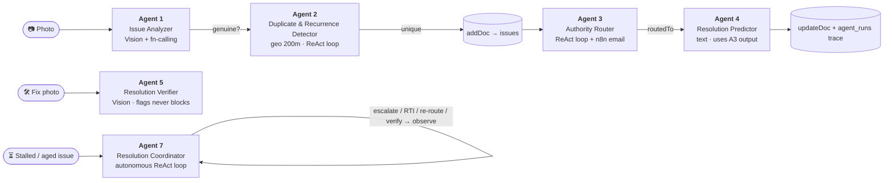
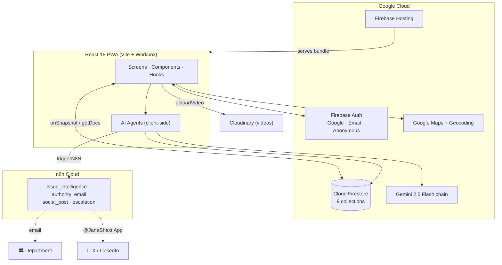
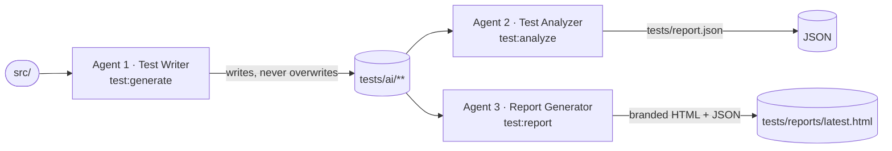

<div align="center">

# JanaShakti — जनशक्ति

### People's Power — a universal civic accountability platform for India (AI-powered PWA)

[](public/manifest.json)
[](https://react.dev)
[](https://vitejs.dev)
[](https://firebase.google.com)
[](https://ai.google.dev)
[](#)
[](#-testing--ai-testing-pipeline)

**Report civic issues. Build community pressure. Hold authorities accountable.**

*Vibe2Ship 2026 · PS2 — Community Hero · Solo developer*

</div>

---

## What is JanaShakti?

**JanaShakti** turns a single photo of a civic problem — a pothole, a dead streetlight, an overflowing bin — into a fully-formed, AI-analysed, authority-routed, community-verifiable complaint with a legal paper trail and an automatic escalation clock.

It closes the loop that every Indian civic-complaint app leaves open: **after you report, nothing happens.** JanaShakti answers that with:

- a **5-agent Google Gemini pipeline** that classifies the issue, drafts the complaint, detects duplicates **and recurrences of already-resolved issues**, routes it to the right department, and predicts a resolution timeline — plus a **6th, post-resolution agent** that scores each resolved issue's ESG (Environmental / Social / Governance) impact and maps it to the UN Sustainable Development Goals, and a **7th, *autonomous* agent** (Resolution Coordinator) that reasons over a stalled issue in a ReAct loop and decides + executes its own next action (escalate / draft RTI / re-route / request verification);
- an **n8n automation layer** that emails the department and posts to social media;
- a **time-based escalation engine** that climbs Ward Officer → Department Head → Commissioner → Media at 7 / 14 / 30 days;
- a **transparency layer** where ward representatives — corporators, RWAs, volunteers, officers, NGOs, or independents — **self-enrol to represent their ward** and are ranked by their real resolution rate (with a neutral by-role view, never party-vs-party), journalists get story-ready feeds, and companies/colleges adopt civic zones;
- a **civic collaboration layer** ("GitHub for civic issues") — anyone can **Join** an issue, post **evidence/updates** to a public **activity timeline**, and **community-verify** the fix (500 m geo-gated voting), earning **Community Reputation** and badges, with AI-checked evidence and anti-shill defenses.

Built **end-to-end on Google's stack** (Gemini · Firebase · Google Maps) with **no custom backend** — all business logic runs client-side and is secured by Firestore Security Rules.

> 🔗 **Live demo:** `https://janashakti-9ded8.web.app` · **Problem statement:** PS2 — Community Hero
> 📚 **Full docs:** [Architecture](docs/ARCHITECTURE.md) · [Features](docs/FEATURES.md) · [Timeline](docs/TIMELINE.md) · [Submission](docs/SUBMISSION.md)

---

## Table of Contents

- [Key Features](#-key-features)
- [The 7-Agent Gemini System](#-the-7-agent-gemini-system)
- [Tech Stack](#-tech-stack)
- [Architecture at a Glance](#-architecture-at-a-glance)
- [Project Structure](#-project-structure)
- [Getting Started](#-getting-started)
- [Environment Variables](#-environment-variables)
- [npm Scripts](#-npm-scripts)
- [Firebase Setup & Deployment](#-firebase-setup--deployment)
- [n8n Automation](#-n8n-automation)
- [Testing & AI Testing Pipeline](#-testing--ai-testing-pipeline)
- [Data Model](#-data-model-cloud-firestore)
- [Security Model](#-security-model)
- [Design System](#-design-system)
- [Data Sources](#-data-sources-production-pipeline)
- [Google Technology Footprint](#-google-technology-footprint)
- [Documentation](#-documentation)
- [License & Credits](#-license--credits)

---

## ✨ Key Features

<table>
<tr><td width="50%" valign="top">

**🤖 AI-Powered Reporting**
- Gemini Vision photo analysis → type, severity, description, department, complaint letter, legal right
- AI guard rail rejects non-civic images (selfies, food, memes)
- Self-correcting analyzer re-examines low-confidence photos
- Manual fallback form when AI is unavailable
- Complaint IDs: `JS-CITY-YEAR-SEQUENCE`
- GPS auto-location + Google reverse geocoding
- Photo (inline base64) + short video (Cloudinary) reports

**🧠 7-Agent Intelligence System**
- Submit pipeline: Analyzer → Duplicate Detector → Authority Router → Resolution Predictor (each output feeds the next)
- Detector & Router reason in **bounded ReAct loops** (multi-step tool use), not single prompts
- Verifier judges fix photos (flags, never blocks); ESG Scorer rates resolved issues
- Autonomous **Resolution Coordinator** (Agent 7) — ReAct loop that escalates / drafts RTI / re-routes
- Live reasoning trace + `agents_log` / `agent_runs` logging + model fallback chain

**🔥 Community Pressure System**
- Pressure Meter (confirmation-threshold bar)
- Geofenced verification within 500 m (+5 civic score)
- Auto-post at 5 confirmations (exactly once)
- Wall of Shame for 30+ day-ignored issues

**⚖️ Legal Empowerment**
- AI-generated RTI applications (RTI Act 2005)
- Formal complaint letters
- Contextual citizen legal rights per issue

**📣 Social Amplification**
- X / WhatsApp / LinkedIn / Facebook / Telegram share links
- Consent model: tag me / anonymous / don't post
- Platform-only auto-posting (no user OAuth)

</td><td width="50%" valign="top">

**🏛️ Automated Accountability (n8n)**
- Auto-escalation engine (7 / 14 / 30-day triggers)
- Escalation chain: Ward → Dept Head → Commissioner → Media
- Formal authority email per report
- SLA tracking per department

**🏆 Civic Gamification**
- Civic score (6 point actions)
- 10 badges (+5 ESG badges) incl. Civic Authority, 5 levels, daily streaks (+2/day)

**🎉 Resolution & Celebration**
- Authority dashboard with status management — authority powers are *earned* via the **Civic Authority** badge (unlocks at 100 civic points, rules-enforced) before a citizen can advance/resolve issues
- Authority actions award points (+5 advance status, +15 resolve)
- Resolution photo upload + AI verification
- Confetti celebration + reporter reward (+25)
- Before/After slider

**🌱 ESG / SDG Impact Scoring**
- Agent 6 scores each resolved issue on Environmental / Social / Governance (each /10) + weighted overall
- Maps issues to UN Sustainable Development Goals (`ISSUE_SDG_MAP`)
- City ESG grade, SDG contributions & rankings in the Analytics ESG tab
- ESG impact metrics + contributed SDGs on profiles
- SEBI-BRSR-style corporate ESG reports

**🚀 Unique Differentiators**
- **Corporate / College zone adoption** + AI CSR reports + LinkedIn posts
- **Journalist dashboard** — story-ready filter, AI press releases, 48h exclusives
- **Representative Accountability** — self-enrolled "claim your ward" reps (civic role: corporator / RWA / volunteer / officer / NGO / independent), GPS→ward tagging, resolution-rate ranking + neutral by-role aggregate (self-declared, community-flagged)
- **Gemini Voice Assistant** — bilingual (EN/HI) Q&A over live, PII-free data
- **Wall of Fame Leaderboard** — Citizens / Companies / Colleges / Representatives
- **Privacy-safe Excel export** — anonymized, on 4 dashboards
- **AI Testing Pipeline** — 3 Gemini agents that write, run & assess tests

</td></tr>
</table>

> 📖 Every feature with its "why" and "how" is documented in **[docs/FEATURES.md](docs/FEATURES.md)**.

---

## 🧠 The 7-Agent Gemini System

All AI routes through `fetchAI()` in [`src/utils/gemini.js`](src/utils/gemini.js). Agents 1–4 run as a coordinated pipeline (`src/agents/orchestrator.js`) — **each agent's output feeds the next** — and every step streams a live trace to the on-screen overlay. **Agents 2 & 3 reason in bounded ReAct loops** (multi-step tool use via Gemini function-calling, sharing `src/agents/reactLoop.js`), and Agent 7 is fully autonomous: it reasons and acts in a loop on demand.



| Agent | File | Gemini mode | Output |
|---|---|---|---|
| **1 · Issue Analyzer** | `agents/issueAnalyzer.js` | Vision + function-calling | type, severity, description, department, complaint, legal right, confidence, genuineness |
| **2 · Duplicate & Recurrence Detector** | `agents/duplicateDetector.js` | geo + **ReAct loop** (compare → widen → decide) | `isDuplicate` (±0.002° ≈ 200 m + similarity > 65%); `checkRecurrence` flags a **resolved** issue that recurs at the same spot within **365 days** → links the prior complaint + "RECURRENCE NOTICE" in the authority email |
| **3 · Authority Router** | `agents/authorityRouter.js` | **ReAct loop** (look-up → check priors → finalize) + n8n | department, officer, email subject, urgency, SLA, escalation path |
| **4 · Resolution Predictor** | `agents/resolutionPredictor.js` | text | priority score, predicted days, escalation risk, recommendation, factors |
| **5 · Resolution Verifier** | `agents/resolutionVerifier.js` | Vision | is the fix genuine & resolved? |
| **6 · ESG Impact Scorer** | `agents/esgScorer.js` | text | post-resolution ESG score across E/S/G + UN SDG mapping |
| **7 · Resolution Coordinator** *(autonomous)* | `agents/resolutionCoordinator.js` | function-calling **ReAct loop** | reasons over a stalled issue and decides + executes its own next action (escalate / draft RTI / re-route / request verification), observing each result and adapting — capped at 4 turns, reasoning shown live |

**Beyond the agents, Gemini also powers:** RTI applications, press releases, CSR reports, city insights, social captions, the voice assistant, and the 3 AI testing agents.
**Model fallback chain:** `gemini-2.5-flash → gemini-2.5-flash-lite → gemini-2.0-flash` (falls through on 404/429/503).
**Serving path:** optional n8n proxy (keeps the key server-side) → direct Gemini (default), via `VITE_N8N_AI_WEBHOOK`.

---

## 🛠 Tech Stack

| Layer | Technology |
|---|---|
| **Framework** | React 18.3 + Vite 5.4 (**JSX only — zero TypeScript**) |
| **Routing** | react-router-dom 6.23 (12 routes, lazy + Suspense) |
| **Icons** | lucide-react 0.383 (no emoji UI icons) |
| **Charts** | recharts 2.12 |
| **PWA** | vite-plugin-pwa 0.20 (Workbox) |
| **Auth + Data + Hosting** | Firebase 10.12 — Auth · Cloud Firestore · Hosting |
| **AI** | Google Gemini 2.5 Flash (Google AI Studio) — vision · text · function-calling |
| **Maps** | Google Maps JavaScript API + Geocoding API |
| **Automation** | n8n Cloud — 4 webhook workflows |
| **Media** | Photos inline base64 in Firestore · short videos on Cloudinary |
| **Testing** | Vitest 2.1 + @testing-library/react + jsdom |
| **Data import (dev)** | firebase-admin 12.7 + xlsx 0.18 + sharp 0.35 |

---

## 🏗 Architecture at a Glance



- **No backend / no Cloud Functions** — Firestore is the single source of truth; security is enforced entirely by **Firestore Security Rules**.
- **Real-time first** — feeds use `onSnapshot`; confirmations run in a **transaction** so the social trigger fires exactly once.
- **Graceful degradation** — every AI call, n8n trigger, and geocode is try/catch-wrapped with a deterministic fallback.

> Full diagrams, data-flow charts, and the agent collaboration model: **[docs/ARCHITECTURE.md](docs/ARCHITECTURE.md)**.

---

## 📁 Project Structure

```
janashakti/
├── src/
│   ├── App.jsx                  # Router shell (12 lazy routes, NavGuard, providers)
│   ├── main.jsx                 # Entry point
│   ├── firebase.js              # Firebase init, Auth, Firestore (persistent cache)
│   ├── index.css                # The only CSS file (per CLAUDE.md)
│   ├── agents/                  # AI agents
│   │   ├── orchestrator.js      # Coordinates the 4-agent submit pipeline
│   │   ├── reactLoop.js         # Shared bounded ReAct-loop helper (Agents 2 & 3)
│   │   ├── issueAnalyzer.js     # Agent 1 — Gemini Vision + function-calling
│   │   ├── duplicateDetector.js # Agent 2 — geo + ReAct loop
│   │   ├── authorityRouter.js   # Agent 3 — ReAct loop + n8n email
│   │   ├── resolutionPredictor.js # Agent 4 — Gemini text
│   │   ├── resolutionVerifier.js  # Agent 5 — Gemini Vision (resolution proof)
│   │   ├── esgScorer.js           # Agent 6 — Gemini text (ESG + SDG)
│   │   └── resolutionCoordinator.js # Agent 7 — autonomous ReAct loop (fn-calling)
│   ├── screens/                 # 12 screens
│   │   ├── HomeScreen.jsx · ReportScreen.jsx · MapScreen.jsx · ProfileScreen.jsx
│   │   ├── IssueDetail.jsx · AnalyticsDashboard.jsx · AuthorityDashboard.jsx
│   │   ├── AgentsShowcase.jsx · Leaderboard.jsx · JournalistDashboard.jsx
│   │   └── NotificationsScreen.jsx · Onboarding.jsx
│   ├── components/              # 30 reusable components (IssueCard, PressureMeter,
│   │                            #   VoiceAssistant, BeforeAfterSlider, ChartCarousel…)
│   ├── hooks/                   # useAuth · useUser · useIssues · useAgents ·
│   │                            #   useLocation · useNotifications · usePagination
│   ├── utils/                   # gemini · n8n · social · escalation · confirmIssue ·
│   │                            #   rti · pressRelease · csrReport · story · exportToExcel ·
│   │                            #   representatives · organizations · orgStats · geocode ·
│   │                            #   googleMaps · cloudinary · complaintId · cityDetect ·
│   │                            #   geo · voiceAssistant …
│   ├── constants/               # issueTypes · departments · cities · representatives ·
│   │                            #   mapStyle · voiceLang
│   └── theme/                   # colors · typography · spacing · components
├── tests/
│   ├── unit/                    # Hand-written deterministic tests
│   ├── ai/                      # AI-GENERATED tests (isolated from `npm test`)
│   ├── agents/                  # 3 Gemini testing agents (writer · analyzer · reporter)
│   └── reports/                 # Branded HTML/JSON test reports
├── scripts/                     # Admin-SDK importers + maintenance (Excel data, representatives, logo, city backfill)
├── n8n/                         # n8n workflow JSON + setup README
├── docs/                        # ARCHITECTURE · FEATURES · TIMELINE · SUBMISSION
├── public/                      # logo, icons, manifest.json
├── firestore.rules              # Field-level security rules
├── firestore.indexes.json       # Composite indexes
├── firebase.json · .firebaserc  # Hosting + Firestore deploy config
├── vite.config.js               # Vite + PWA + Vitest config
└── .env.example                 # Environment template
```

---

## 🚀 Getting Started

### Prerequisites

- **Node.js 18+** and npm
- A **Firebase** project (Auth + Firestore enabled)
- A **Google AI Studio** API key (Gemini) — [aistudio.google.com/apikey](https://aistudio.google.com/apikey)
- A **Google Maps** API key (Maps JavaScript + Geocoding enabled)
- *(Optional)* a **Cloudinary** account (video uploads) and an **n8n Cloud** account (automation)

### Install & run

```bash
# 1. Install dependencies
npm install

# 2. Configure environment
cp .env.example .env        # then fill in your keys (see below)

# 3. Start the dev server
npm run dev                 # → http://localhost:5173

# 4. Production build + local preview
npm run build
npm run preview
```

> The app degrades gracefully: missing n8n / Cloudinary keys simply disable those features. A missing Gemini key falls back to the manual report form.

---

## 🔐 Environment Variables

Copy `.env.example` → `.env` and fill in. **Never commit `.env`.** All keys are read via `import.meta.env.VITE_*`.

| Variable | Required | Purpose |
|---|---|---|
| `VITE_FIREBASE_API_KEY` | ✅ | Firebase web SDK config |
| `VITE_FIREBASE_AUTH_DOMAIN` | ✅ | Firebase Auth domain |
| `VITE_FIREBASE_PROJECT_ID` | ✅ | Firestore project |
| `VITE_FIREBASE_STORAGE_BUCKET` | ✅ | Config field (Storage **not** used at runtime) |
| `VITE_FIREBASE_MESSAGING_SENDER_ID` | ✅ | Firebase config |
| `VITE_FIREBASE_APP_ID` | ✅ | Firebase config |
| `VITE_FIREBASE_MEASUREMENT_ID` | ➖ | Analytics (optional) |
| `VITE_GEMINI_API_KEY` | ✅ | Google AI Studio key — powers all AI |
| `VITE_GOOGLE_MAPS_KEY` | ✅ | Google Maps JS + Geocoding |
| `VITE_CLOUDINARY_CLOUD_NAME` | ➖ | Short report-video hosting |
| `VITE_CLOUDINARY_UPLOAD_PRESET` | ➖ | Cloudinary **unsigned** preset |
| `VITE_N8N_AI_WEBHOOK` | ➖ | Optional AI proxy (keeps model key server-side) |
| `VITE_N8N_ISSUE_WEBHOOK` | ➖ | `issue_intelligence` workflow |
| `VITE_N8N_SOCIAL_WEBHOOK` | ➖ | `social_post` workflow |
| `VITE_N8N_AUTH_WEBHOOK` | ➖ | `authority_email` workflow |
| `VITE_N8N_ESCALATE_WEBHOOK` | ➖ | `escalation` workflow |

---

## 📜 npm Scripts

| Script | What it does |
|---|---|
| `npm run dev` | Start the Vite dev server |
| `npm run build` | Production build → `dist/` |
| `npm run preview` | Preview the production build locally |
| `npm test` | Run the **deterministic** suite (`src/**` + `tests/unit`) |
| `npm run test:watch` | Vitest watch mode |
| `npm run test:coverage` | Coverage over the deterministic suite |
| `npm run test:ai` | Run only the **AI-generated** tests (`tests/ai`) |
| `npm run test:generate` | **Agent 1** — Gemini writes tests into `tests/ai/**` |
| `npm run test:analyze` | **Agent 2** — run + Gemini diagnoses failures → `tests/report.json` |
| `npm run test:report` | **Agent 3** — run + coverage + Gemini health report → `tests/reports/` |
| `npm run test:full` | Agent 1 (generate) → Agent 3 (run + report) |
| `npm run deploy` | Build + deploy Hosting **and** Firestore rules + indexes |
| `npm run deploy:rules` | Deploy only Firestore rules + indexes |
| `npm run import:data` | Admin-SDK import of the demo dataset (`scripts/importExcel.mjs`) |

---

## 🔥 Firebase Setup & Deployment

1. Create a Firebase project; enable **Authentication** (Google, Email/Password, Anonymous) and **Cloud Firestore**.
2. Copy the web-app SDK config into your `.env` (the `VITE_FIREBASE_*` keys).
3. Set the active project (already wired to `janashakti-9ded8` in `.firebaserc`):
   ```bash
   firebase use --add        # select your project
   ```
4. Deploy:
   ```bash
   npm run deploy            # Hosting + Firestore rules + indexes
   # or just the rules/indexes:
   npm run deploy:rules
   ```

**Hosting config** (`firebase.json`): serves `dist/`, SPA rewrite `** → /index.html`, a `Cross-Origin-Opener-Policy` header (so Google auth popups work), immutable caching for `/assets/**`, and no-cache for the service worker + manifest.

> **Free-tier by design:** the app runs entirely on the Firebase **Spark** plan. Firebase Storage is intentionally **not** used — photos are stored inline as compressed base64 on the issue document, and videos go to Cloudinary.

---

## 🤖 n8n Automation

Four fire-and-forget webhook workflows (`src/utils/n8n.js`), all try/catch-wrapped so a webhook outage never affects the app:

| Workflow | Env var | Trigger | Action |
|---|---|---|---|
| `issue_intelligence` | `VITE_N8N_ISSUE_WEBHOOK` | every new report | Logging / dashboards |
| `authority_email` | `VITE_N8N_AUTH_WEBHOOK` | Agent 3 routing | Formal complaint email to the department (HTTP node) |
| `social_post` | `VITE_N8N_SOCIAL_WEBHOOK` | Critical / ≥ 5 confirmations | Post to `@JanaShaktiApp` (X / LinkedIn) |
| `escalation` | `VITE_N8N_ESCALATE_WEBHOOK` | escalation level increase | Escalation + Wall-of-Shame alert |

An optional AI proxy (`VITE_N8N_AI_WEBHOOK`) keeps the model API key server-side. Workflow JSON + setup notes are in [`n8n/`](n8n/README.md).

---

## 🧪 Testing & AI Testing Pipeline

The suite is split into a **deterministic** set (always green) and an **AI-generated** set (isolated):

- `npm test` runs only `src/**` + `tests/unit` — so a flaky AI test can never red the build.
- `npm run test:ai` runs the AI-generated tests under `tests/ai/**`.

**3 Gemini-powered testing agents** (`tests/agents/`):



1. **Test Writer** — reads ~36 source targets and generates Vitest + Testing-Library tests.
2. **Test Analyzer** — runs the suite, classifies failures (`MOCK_ISSUE / IMPORT_ERROR / LOGIC_BUG / TEST_ISSUE`) + health note.
3. **Report Generator** — runs suite + coverage, Gemini health/risk assessment → branded HTML report.

> **Latest run:** **176 deterministic tests passing** across 26 files (`npm test` — `src/**` + `tests/unit`), plus the Gemini-generated tier under `tests/ai/**`. Testing-agent models: `gemini-2.5-flash → gemini-2.5-flash-lite → gemini-2.0-flash`.

---

## 🗄 Data Model (Cloud Firestore)

Nine top-level collections (+ two per-issue collaboration subcollections), all written client-side and secured by `firestore.rules`:

| Collection | Purpose |
|---|---|
| `issues` | The central document — report → routing → prediction → resolution → collaboration → story (~60 fields) |
| `issues/{id}/timeline` · `/evidence` | Per-issue collaboration — immutable activity timeline + uploaded evidence (subcollections) |
| `users` | Private profile (owner-only) — score, badges, level, streak, affiliation |
| `publicProfiles` | Public, display-only leaderboard mirror |
| `organizations` | Adopted-zone companies / colleges |
| `agents_log` | Per-agent audit log (input, output, latency, success, model) |
| `agent_runs` | Orchestrated pipeline step-traces (Agents Showcase) |
| `representatives` | Ward → civic role-holder — community self-enrolled ("claim your ward") + fallback |
| `authorities` | Authority allowlist (gates trust-sensitive fields) |
| `meta` | Seed marker (vestigial) |

Composite indexes are in `firestore.indexes.json`. Full field-by-field schema: **[docs/ARCHITECTURE.md §5](docs/ARCHITECTURE.md)**.

---

## 🛡 Security Model

- **Field-level Firestore rules** — owners may write any field on their own issue; **authorities** (allowlist) may write only status/resolution/agent fields; **any signed-in user** may touch only low-trust community fields (confirmations, escalation, story claim within a 48h window).
- **Auth** — Google · Email/Password · Anonymous; user profiles auto-created on first sign-in (identity-only refresh on return — never re-zeroes score).
- **API keys** — all in `import.meta.env.VITE_*`; an optional n8n AI proxy removes the model key from the client; Cloudinary uses an **unsigned** preset.
- **Abuse controls** — AI guard rail blocks non-civic images; verification is GPS-geofenced to 500 m; one vote per user; exactly-once social posting; Agent 5 flags fake fix photos.
- **Privacy** — Excel exports are anonymized (allowlist sanitization, name masking, no uids/emails/coordinates); the voice assistant processes speech on-device and stores no audio.
- **Social consent** — per-issue `tag` / `anonymous` / `none`; posts originate only from `@JanaShaktiApp` (no user OAuth).

---

## 🎨 Design System

A strict palette derived from the JanaShakti holographic-fist logo (see `src/theme/` and the project `CLAUDE.md`):

| Token | Hex | Use |
|---|---|---|
| Cyan (primary) | `#00d4ff` | Buttons, active tabs, links, brand |
| Green (secondary) | `#16a34a` | Success, civic score, resolved |
| Screen background | `#080f1e` | All screens |
| Card background | `#0d1b2e` | All cards (0.5px border `#1a2f4a`) |
| Text primary / body / muted | `#f0f6ff` / `#94a3b8` / `#7689a3` | Typography hierarchy |

Severity: Critical `#ef4444` · High `#f97316` · Medium `#eab308` · Low `#22c55e`.
**Rules:** JSX only · Lucide icons only (no emoji UI icons) · string font-weights · LinkedIn-style cards.

---

## 🌐 Data Sources (production pipeline)

Reference data (wards, representatives, civic baselines) is designed to ingest via the Admin SDK (`scripts/importRepresentatives.mjs`, `scripts/importExcel.mjs`) from India's open-data ecosystem:

- **data.gov.in** — Open Government Data civic datasets
- **lgdirectory.gov.in** — official Local Government Directory ward codes
- **myneta.info** — ADR/MyNeta elected-representative records
- **datameet / india-election-data** — community ward-boundary GeoJSON
- **smartcities.data.gov.in** — Smart Cities Mission datasets

*(The shipped demo uses a curated built-in fallback ward list, extensible per-city through the importer.)*

---

## 🔵 Google Technology Footprint

| Google product | Where it powers JanaShakti |
|---|---|
| **Gemini 2.5 Flash** (AI Studio) | All 7 agents — the 6-agent report→route→predict→verify→ESG flow **plus the autonomous Resolution Coordinator (Agent 7)** — + RTI, press releases, CSR reports, city insights, social captions, the voice assistant, and the 3 AI testing agents. Uses vision, text & function-calling (incl. a ReAct decision loop). |
| **Firebase Authentication** | Google · Anonymous · Email sign-in, with auto-created profiles |
| **Cloud Firestore** | Real-time database of record (9 collections) with offline IndexedDB persistence |
| **Firebase Hosting** | Global SPA + PWA delivery, SPA rewrites, auth-popup COOP header |
| **Google Maps JavaScript API** | Dark-themed map, severity markers, adopted-zone overlays, draggable picker |
| **Google Maps Geocoding API** | Reverse + forward geocoding |
| **Firebase Security Rules** | Field-level, zero-backend authorization |

---

## 📚 Documentation

| Document | Contents |
|---|---|
| **[docs/ARCHITECTURE.md](docs/ARCHITECTURE.md)** | System & application architecture, agent pipeline, 8 data-flow diagrams, full Firestore schema, API integrations, n8n, AI testing pipeline, security |
| **[docs/FEATURES.md](docs/FEATURES.md)** | Every feature with what / why / how, gamification tables, issue types, cities, PWA |
| **[docs/TIMELINE.md](docs/TIMELINE.md)** | Day-by-day build log (June 24–29, 2026) |
| **[docs/SUBMISSION.md](docs/SUBMISSION.md)** | Official Vibe2Ship 2026 submission — overview, features, Google-tech detail |

---

## 📄 License & Credits

Built for **Vibe2Ship 2026** (PS2 — Community Hero) by a **solo developer**.

Open-source libraries: React, React DOM, Vite (MIT) · react-router-dom, recharts, vitest (MIT) · lucide-react (ISC) · firebase, firebase-admin, sharp, xlsx (Apache-2.0). Google Gemini, Firebase, and Google Maps are used under Google's API Terms of Service; n8n under the Sustainable Use License; Cloudinary under its free-tier ToS.

---

<div align="center">

**JanaShakti — जनशक्ति — People's Power**
*Vibe2Ship 2026 — PS2: Community Hero*

</div>
