# JanaShakti — System Architecture

> **जनशक्ति — People's Power**
> An AI-powered civic-intelligence Progressive Web App for India.
> Vibe2Ship 2026 · PS2 Community Hero · *Built on the Google technology stack, in collaboration with Google.*

This document is the engineering reference for JanaShakti. It maps the full system —
frontend, data layer, the AI agent pipeline, and the automation layer — and documents
every data flow, the database schema, every external integration, the technology
credits, and the security model.

| | |
|---|---|
| **Type** | Mobile-first Progressive Web App (installable, offline-capable) |
| **Language** | JSX only (React 18) — zero TypeScript |
| **Build** | Vite 5 + `vite-plugin-pwa` (Workbox) |
| **Data** | Google Firebase — Auth + Cloud Firestore + Hosting |
| **AI** | Google Gemini 2.5 Flash (via Google AI Studio) — 6-agent pipeline |
| **Maps** | Google Maps JavaScript API + Geocoding API |
| **Automation** | n8n Cloud — 4 webhook workflows |
| **Media** | Photos inline as base64 in Firestore · short videos on Cloudinary |

> **A note on Firebase Storage:** The original brief lists "Storage" as part of the
> Firebase footprint. In the shipped implementation **Firebase Storage is deliberately
> NOT used** — it requires the paid Blaze plan. Instead, photos are compressed and
> stored **inline as base64 data URLs** on the Firestore issue document (kept under the
> 1 MiB doc limit), and short report videos are uploaded to **Cloudinary** (unsigned
> preset, free tier) with only the URL stored on the doc. This keeps the app fully
> free-tier (Spark plan) friendly. Diagrams below reflect the real implementation.

---

## 1. System Architecture Overview

JanaShakti is a four-tier system. A user action in the **React PWA** writes to
**Cloud Firestore**; the write is orchestrated through a **6-agent Gemini pipeline**;
side effects (authority email, social amplification, escalation) are dispatched to
**n8n Cloud** webhooks. Real-time `onSnapshot` listeners stream every change back to
the UI.

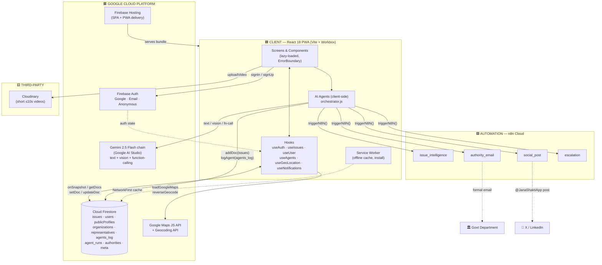

### End-to-end data flow (the canonical path)

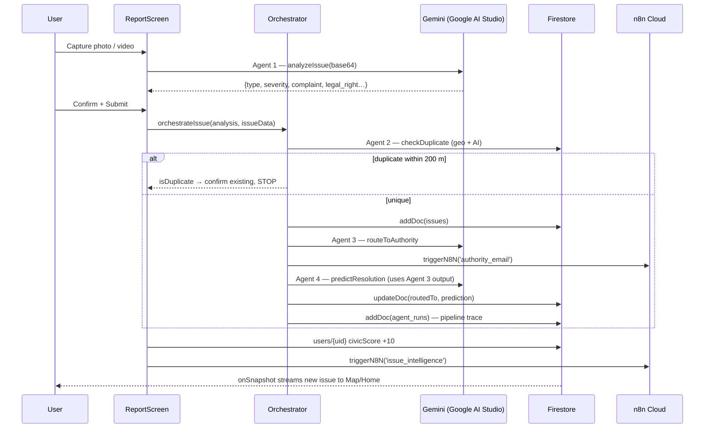

**Key architectural decisions**

- **No backend / no Cloud Functions.** All "business logic" (agents, escalation,
  scoring, leaderboards, notifications) runs client-side. Firestore is the single
  source of truth; security is enforced entirely by **Firestore Security Rules**.
- **Real-time first.** Feeds use `onSnapshot`, not `getDocs`, so the UI is live.
- **Atomicity where it matters.** Confirmations run in a Firestore **transaction**
  (`confirmIssue`) so the social-post trigger fires exactly once.
- **Graceful degradation.** Every AI call, n8n trigger, and geocode is wrapped in
  try/catch with a deterministic fallback — an outage never crashes the submit flow.
- **Load once.** A single app-wide geolocation watch (`LocationProvider` →
  `useSharedLocation`) plus a background prewarm of the Maps script, organizations,
  representatives, and civic context at startup — so Map / Leaderboard / the assistant
  open against warm caches instead of fetching on first navigation.

---

## 2. Component Architecture

### 2.1 Routing & shell

`App.jsx` defines a `BrowserRouter` with lazy-loaded routes inside `Suspense` +
`ErrorBoundary` + `ToastProvider`. A `NavGuard` hides `BottomNav` on secondary routes.

| Route | Screen | Bottom nav | Notes |
|---|---|---|---|
| `/` | `HomeScreen` | ✅ | Auth lives here (Google / Guest / Email) · City ESG grade chip → `/analytics` ESG tab |
| `/report` | `ReportScreen` | ✅ | Raised green camera FAB |
| `/map` | `MapScreen` | ✅ | Google Maps markers + adopted zones |
| `/profile` | `ProfileScreen` | ✅ | Score, badges, affiliation · ESG Impact metrics + contributed SDGs + ESG badges |
| `/issue/:id` | `IssueDetail` | ❌ (back) | Verify, RTI, share, escalation, elected-rep card · ESG card + SDG pills + ESG Report share |
| `/analytics` | `AnalyticsDashboard` | ❌ (back) | Recharts + AI insights · ESG tab (`location.state.tab==='esg'`) |
| `/authority` | `AuthorityDashboard` | ❌ (back) | Status / resolution — **gamification-gated** (civicScore ≥ 100 = Civic Authority badge; locked card + progress bar below threshold, "Enable Authority Mode" when qualified) · acting authority earns +5/status, +15/resolve · per-department filter · fires Agent 6 on resolve |
| `/agents` | `AgentsShowcase` | ❌ (back) | Live agent traces |
| `/leaderboard` | `Leaderboard` | ❌ (back) | Wall of Fame + CSR report + Representative scorecard |
| `/journalist` | `JournalistDashboard` | ❌ (back) | Story-ready + press release |
| `/notifications` | `NotificationsScreen` | ❌ (back) | Derived notification feed |
| `/onboarding` | `Onboarding` | ❌ (none) | 3-step affiliation setup |

### 2.2 Dependency graph

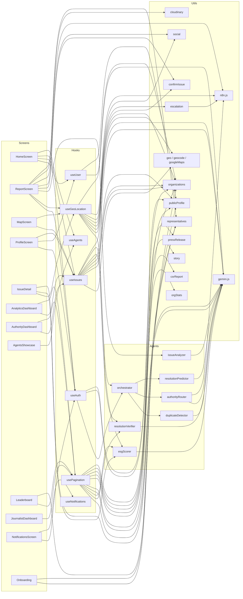

### 2.3 Per-screen dependency table

| Screen | Hooks | Agents / AI | Utils | n8n | Firestore writes |
|---|---|---|---|---|---|
| **HomeScreen** | useAuth, useUser, useIssues, useAgents | — | firebase auth fns, esg (City ESG grade chip → `/analytics` ESG tab) | — | — |
| **ReportScreen** | useAuth, useSharedLocation | `analyzeIssue` (A1) → `orchestrateIssue` (A2-A4) | gemini, cloudinary, media, validation, social, complaint, complaintId, publicProfile, confirmIssue, representatives (ward→rep tag) | `issue_intelligence`, `social_post` (+ `authority_email` via A3) | `issues` (addDoc incl. `wardInfo`), `users` (score), `publicProfiles` |
| **IssueDetail** | useSharedLocation | `generateRTI` (Gemini), `scoreESGImpact` (A6, owner-gated fallback on Resolved) | escalation, geo, social, confirmIssue, publicProfile, cloudinary, n8n, representatives (rep card), esg (ESG card + SDG pills + ESG Report share) | `social_post`, `escalation` | `issues` (verify/escalate/celebrate, `esgScore`), `users` (score, ESG stats) |
| **MapScreen** | useIssues, useSharedLocation | — | googleMaps, geo, organizations, mapStyle | — | — (read-only) |
| **ProfileScreen** | useAuth, useUser, useIssues | — | organizations, publicProfile, issueTypes, esg (ESG Impact metrics, contributed SDGs, ESG badges) | — | `users` (affiliation, count reconcile), `publicProfiles` |
| **AnalyticsDashboard** | useIssues, usePagination | `generateCityInsights` (Gemini) | trend, cities, exportToExcel, ChartCarousel, esg (ESG tab: City ESG grade, SDG Contributions, City Rankings, Top Environmental Impact) | — | — (read-only) |
| **AuthorityDashboard** | useAuth (civicScore gate), useIssues, usePagination | `verifyResolution` (A5), `scoreESGImpact` (A6, on resolve) | authority, departments (per-dept filter), gemini (compress), validation, exportToExcel, esg, issueTypes (`AUTHORITY_THRESHOLD`, `CIVIC_SCORE_POINTS`), publicProfile (`bumpPublicProfile`) | — | `issues` (status/resolution, `esgScore`), `authorities` (enroll, civicScore ≥ 100 gated), `users` + `publicProfiles` (acting authority +5/status, +15/resolve) |
| **AgentsShowcase** | useAgents | — (displays traces) | — | — | — (read-only) |
| **Leaderboard** | usePagination | `generateCSRReport` (Gemini) | organizations, orgStats, publicProfile, levelFor, representatives (calculateScorecard), exportToExcel | — | `publicProfiles` (self-heal own score) |
| **JournalistDashboard** | usePagination | `generatePressRelease` (Gemini) | story, exportToExcel | — | `issues` (storyClaimedBy/At) |
| **NotificationsScreen** | useAuth, useNotifications | — | — | — | `users` (notificationsSeenAt) |
| **Onboarding** | — | — | organizations, publicProfile | — | `users` (onboardingComplete, affiliation, xHandle) |

### 2.4 Hooks

| Hook | Source | Returns | Firestore |
|---|---|---|---|
| `useAuth` | `onAuthStateChanged` | `{ user, userProfile, loading }` | reads `users/{uid}`; updates daily streak; `syncPublicProfile` |
| `useUser(uid)` | `onSnapshot` | `{ profile, loading }` | live `users/{uid}` |
| `useIssues({userId, severity, status, limitCount})` | `onSnapshot` | `{ issues, loading, error }` | composite-indexed `issues` query |
| `useAgents` | `getCountFromServer` ×6 + `getDocs` | `{ stats, recentRuns, loading }` | aggregates `agents_log` (incl. `esg_scorer`); reads `agent_runs` |
| `useGeoLocation` | `watchPosition` | `{ location, locationText, accuracy, error }` | calls Google reverse-geocode |
| `useSharedLocation` | `LocationProvider` context | same shape as `useGeoLocation` | one app-wide GPS watch shared by all screens (de-dupes the former per-screen watches) |
| `useNotifications(uid)` | derives from `useIssues` | `{ items }` | none (client-derived from statusHistory + flags) |
| `usePagination(items, pageSize)` | local state | `{ visible, hasMore, remaining, showMore }` | none (client-side "Show more") |

### 2.5 Shared components

**Presentational (pure):** `BottomNav`, `TopNav`, `IssueCard` (memo), `SeverityBadge`
(memo), `PressureMeter` (memo), `StatsCard` (memo), `EmptyState`, `LoadingScreen`,
`LoadingSkeleton`, `ShowMore`, `Toast`, `Avatar`, `IndiaFlag`, `NationTagline`,
`ResolutionCelebration`, `AgentPipelineOverlay`, `BeforeAfterSlider`, `ChartCarousel`
(swipeable analytics charts), `ESGScoreCard` (memo), `SDGBadge` (memo), `CityESGCard`
(memo).

**Stateful / integrated:** `ToastProvider` (context + `useToast`), `LocationProvider`
(single app-wide geolocation watch + background cache prewarm; exposes `useSharedLocation`),
`VoiceAssistant` (floating civic Q&A — Web Speech STT/TTS + Gemini over live aggregate
data, English/Hindi, location-aware), `ErrorBoundary` (class component), `InstallBanner`
(PWA `beforeinstallprompt`), `NotificationBell` (useUser + useNotifications),
`LocationPicker` (Google Maps draggable pin + reverse-geocode), `AffiliationPicker`
(loadOrganizations + forwardGeocode + createOrganization).

**Theme:** `theme/colors.js`, `theme/typography.js`, `theme/spacing.js` (+ `radius`),
`theme/components.js` (reusable style objects + `severityStyle()` + `statusColor()`).

---

## 3. AI Agent Pipeline

JanaShakti ships **6 Gemini-powered agents**. Four run as a coordinated pipeline at
submit time via `agents/orchestrator.js`; the fifth (Verifier) runs when an authority
uploads resolution proof; the sixth (ESG Impact Scorer) runs **after an issue is
Resolved**. Every agent call routes through `utils/gemini.js`
(`callGeminiText` / `callGeminiVision` / `callGeminiVisionFunction` /
`callGeminiPlainText`) and logs to the `agents_log` collection via `logAgent()`.

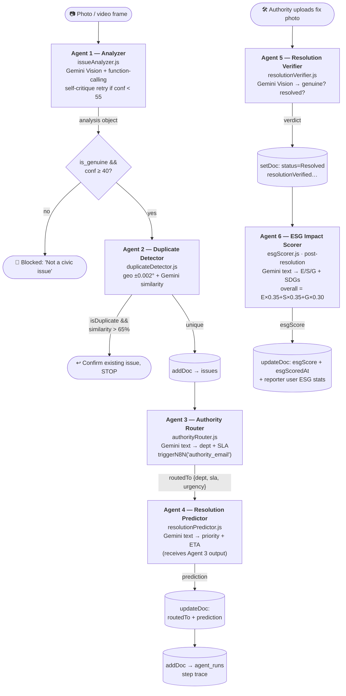

### Agent collaboration — the key design point

The orchestrator does **not** run the agents independently. Agent 3's output (the real
routed department + SLA) is **passed into Agent 4** so the prediction reasons over the
actual department rather than `"Unknown"`. Each step emits a live snapshot to
`AgentPipelineOverlay` so the reasoning is visible to the user, and the full step trace
is persisted to `agent_runs` for the Agents Showcase.

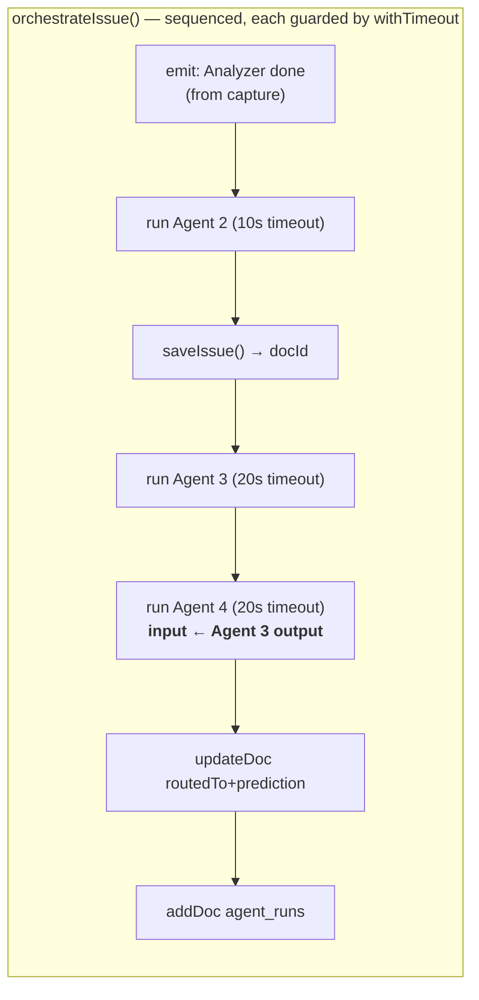

### Agent specifications

#### Agent 1 — Issue Analyzer (`issueAnalyzer.js`)
| | |
|---|---|
| **Trigger** | On photo/video-frame capture in `ReportScreen` |
| **Input** | base64 image, temp issue id |
| **Method** | Native Gemini **function-calling** (`report_civic_issue` typed schema); falls back to prompt-based JSON (`callGeminiVision`) on any failure |
| **Prompt summary** | "You are an AI assistant for JanaShakti… **GUARD RAIL: relevance check FIRST** — only genuine outdoor public/civic infrastructure (potholes, lights, garbage, water, signals). Reject selfies/food/indoor/memes → `is_genuine:false`, conf < 40, polite `reject_reason`." |
| **Output** | `{ issue_type, severity, description, department, complaint_text, legal_right, predicted_days, is_genuine, confidence, reject_reason, tags }` |
| **Self-correction** | If `is_genuine ≠ false` but `confidence < 55` (`RETRY_THRESHOLD`), re-examines once with a self-critique suffix and keeps the more confident result (`retried` flag surfaced in the trace) |
| **Firestore writes** | `agents_log` (`agentName: issue_analyzer`). Fields are copied onto the issue doc by `ReportScreen`, not by the agent |
| **Error handling** | Logs failure to `agents_log` with `success:false` then **throws** → `ReportScreen` shows the manual fallback form (type/severity/description) |

#### Agent 2 — Duplicate & Recurrence Detector (`duplicateDetector.js`)
| | |
|---|---|
| **Trigger** | First step inside `orchestrateIssue`, before save |
| **Input** | new issue data (location, issueType, description) |
| **Method** | Query `issues` where `status in [Reported, Verified, In Progress]` and `issueType ==`, then filter to **±0.002° (`NEARBY_GEO_BOUND`, ~200 m)**. If neighbours exist, ask Gemini for similarity |
| **Prompt summary** | "Are these two civic issue reports describing the same problem? Report A (new) … Report B (existing) … Return `{ isDuplicate, similarity, reasoning }`." |
| **Output** | `{ isDuplicate: (result && similarity > 65), existingIssueId, similarity }` |
| **Recurrence** | `checkRecurrence` additionally scans **Resolved** issues of the same type within **~200 m** that were resolved in the last **`RECURRENCE_WINDOW_DAYS` (365)** days. A match means the new report is a *recurrence* — the earlier fix didn't hold. The new issue is saved with `recurrenceOf` / `recurrenceOfComplaintId` / `recurrenceResolvedAt` / `recurrenceDaysSince` / `recurrenceCount`; the detector step flags it live; Agent 3's authority email cites the prior complaint; IssueDetail shows a "Recurring issue" banner linking the earlier report. **Deterministic** (no AI) — "same type, same spot, recently closed" is the recurrence grain |
| **Firestore** | reads `issues`; writes `agents_log` (`duplicate_detector`) |
| **Error handling** | Any failure → logs `success:false` and returns `{ isDuplicate:false }` (fail-open: a new report is created rather than lost); `checkRecurrence` fails-open to `{ isRecurrence:false }` |

#### Agent 3 — Authority Router (`authorityRouter.js`)
| | |
|---|---|
| **Trigger** | After save, inside orchestrator |
| **Input** | issue (city, ward, type, severity, description) + `DEPARTMENT_MAP` default |
| **Prompt summary** | "For this civic issue in India … Return `{ departmentName, departmentCode, wardOffice, officerTitle, emailSubject, urgencyLevel, slaHours, escalationPath }`." `departmentCode` & `slaHours` seeded from the static `DEPARTMENT_MAP` |
| **Output** | router result **+** `{ emailSent:true, emailSentAt }` |
| **Side effect** | `triggerN8N('authority_email', …)` with the full complaint payload + `issueUrl` |
| **Firestore** | writes `agents_log` (`authority_router`); orchestrator persists `routedTo` onto the issue |
| **Error handling** | Logs failure, returns a deterministic fallback from `DEPARTMENT_MAP[issueType]` (`emailSent:false`) so routing always yields a department |

#### Agent 4 — Resolution Predictor (`resolutionPredictor.js`)
| | |
|---|---|
| **Trigger** | After Agent 3, **fed Agent 3's `routedTo`** |
| **Input** | type, severity, city, confirmations, days open, escalation level, **department from Agent 3** |
| **Prompt summary** | "You are a civic AI analyst… Predict resolution likelihood. Return `{ priority_score, predicted_days, escalation_risk, recommendation, confidence, factors[] }`." |
| **Output** | prediction object (rendered on `IssueDetail` + `AuthorityDashboard` priority) |
| **Firestore** | writes `agents_log` (`resolution_predictor`); orchestrator persists `prediction` |
| **Error handling** | Logs failure, returns a safe default (`priority 50, 14 days, Medium risk`) |

#### Agent 5 — Resolution Verifier (`resolutionVerifier.js`)
| | |
|---|---|
| **Trigger** | Authority uploads a fix photo on `AuthorityDashboard` |
| **Input** | base64 fix photo + original issue |
| **Prompt summary** | "An authority uploaded a photo claiming this is FIXED. Judge whether it plausibly shows THIS issue resolved (repaired road / clean spot / working light). Be skeptical of unrelated/selfie/indoor/still-broken. Return `{ is_genuine, is_resolved, confidence, reasoning }`." |
| **Output** | verdict → sets `resolutionVerified`, `resolutionGenuine`, `resolutionConfidence`, `resolutionNote` |
| **Behaviour** | **Flags, never blocks.** On any error it returns an optimistic `is_genuine/is_resolved:true` verdict so the resolve flow can't break |
| **Firestore** | writes `agents_log` (`resolution_verifier`); dashboard writes the resolution fields |

#### Agent 6 — ESG Impact Scorer (`esgScorer.js`)
| | |
|---|---|
| **Trigger** | **After an issue is Resolved** — called from `AuthorityDashboard` on resolve; an owner-gated fallback effect in `IssueDetail` scores it if it was missed |
| **Exports** | `scoreESGImpact(issue, issueId)` (per-issue scoring) and `generateCorporateESGReport(companyData)` |
| **Input** | the resolved issue (type, severity, description, city, …) + `issueId` |
| **Method** | `callGeminiText` returns per-pillar `e_score` / `s_score` / `g_score` (+ an `impact` + `metric` per pillar); the code then **overrides `overall_esg`** with a deterministic weighted blend **E×0.35 + S×0.35 + G×0.30** (`ESG_WEIGHTS`), clamped 0–10. SDGs are mapped from the issue type via `ISSUE_SDG_MAP` (`sdg_tags`, `sdg_names`) plus a `highlight` |
| **Output** | `esgScore` map (per-pillar scores/impacts/metrics, blended `overall_esg`, `sdg_tags`, `sdg_names`, `highlight`) |
| **Firestore writes** | `updateDoc(issues)` → `esgScore` + `esgScoredAt`; then increments the **reporter's** `users` doc (`esgIssuesResolved`, `totalPeopleImpacted` via `increment()`, `sdgsContributed` via `arrayUnion()`) inside its **own** try/catch — a cross-user stats write denied by the rules never nullifies the already-saved score. Logs `agents_log` (`agentName: esg_scorer`) |
| **Corporate report** | `generateCorporateESGReport` uses `callGeminiPlainText` (plain text, not JSON) to produce a **SEBI-BRSR-style** report |
| **Constants** | `constants/esg.js` — `ISSUE_SDG_MAP`, `SDG_COLORS`, `ESG_WEIGHTS`, `IMPACT_ESTIMATES`, `ESG_GRADES`, `ESG_BADGES` |

---

## 4. Data Flow Diagrams

### 4.1 Issue Reporting Flow

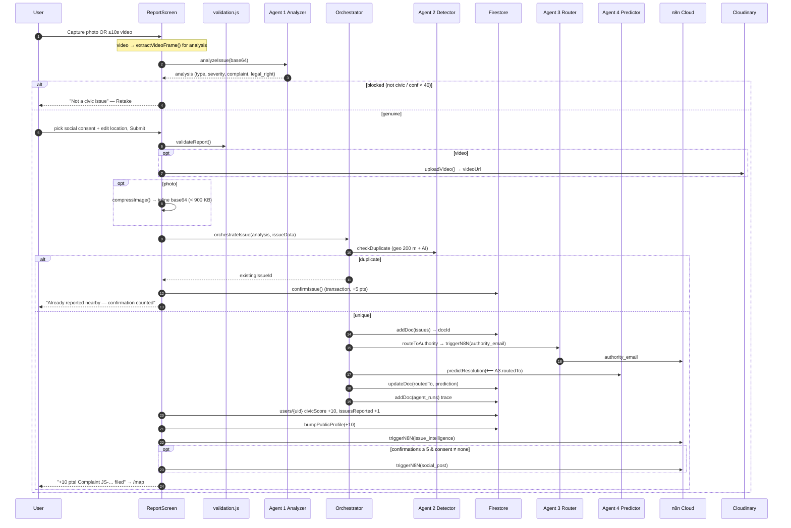

### 4.2 Issue Verification Flow

`IssueDetail.handleVerify` — one vote per user, geofenced to **500 m** (`VERIFY_RADIUS_KM`,
Haversine `distanceKm`). The confirmation runs in a **transaction** so the social
trigger fires exactly once.

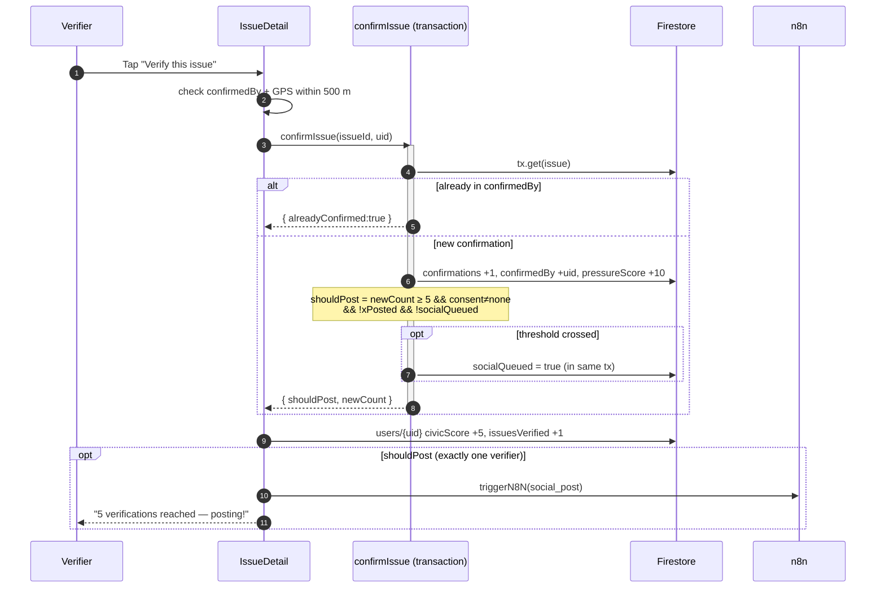

### 4.3 Escalation Flow

Time-based, checked **on view** (`IssueDetail` calls `checkAndEscalate` once per load).
Thresholds from `ESCALATION_LEVELS`: L0 Ward (day 0) → L1 Dept Head (7d) → L2
Commissioner (14d) → L3 Media & Public Alert (30d). At **30 days** the issue is flagged
to the **Wall of Shame** and surfaced to journalists.

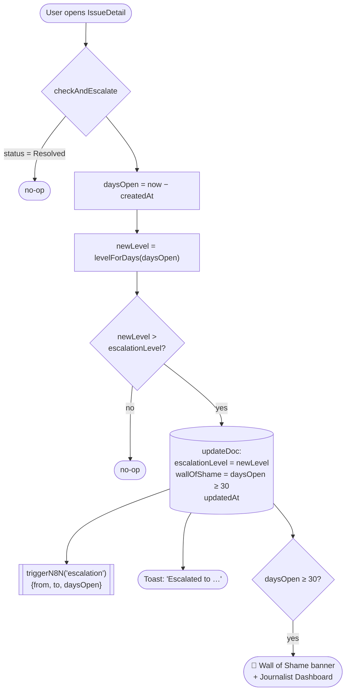

### 4.4 Resolution Flow

`AuthorityDashboard.handleResolvePhoto` (gated by the `authorities` allowlist, which a
user only joins after earning the **Civic Authority** badge — civicScore ≥ 100) →
**Agent 5** verifies the fix photo → status flips to **Resolved** → `IssueDetail`'s
`onSnapshot` detects the transition, fires `ResolutionCelebration`, and awards the
reporter **+25** (once, via `resolutionCelebrated` guard). The resolve also fires
**Agent 6 — ESG Impact Scorer** (with ESG toasts); an owner-gated fallback effect in
`IssueDetail` scores the issue if the dashboard missed it. The **acting authority** is
itself rewarded civic points — **+5** per status advance and **+15** per resolve (via
`awardAuthorityPoints`, mirrored to `publicProfiles`).

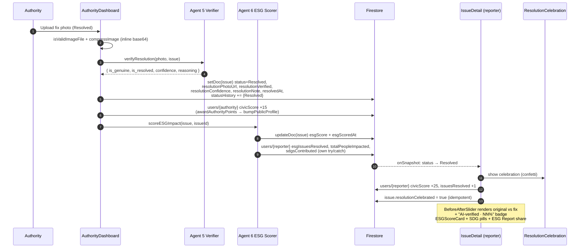

### 4.5 Corporate / Campus Adoption Flow

Adoption is **profile-driven**, not GPS-driven. A user sets an affiliation
(college/company) in Onboarding/Profile via `AffiliationPicker`. Every issue they
report is tagged with `adoptedBy {id, name, type}`. Org leaderboard + CSR numbers are
computed **live** from the `issues` collection (`orgStats.js`) — never stored counters.

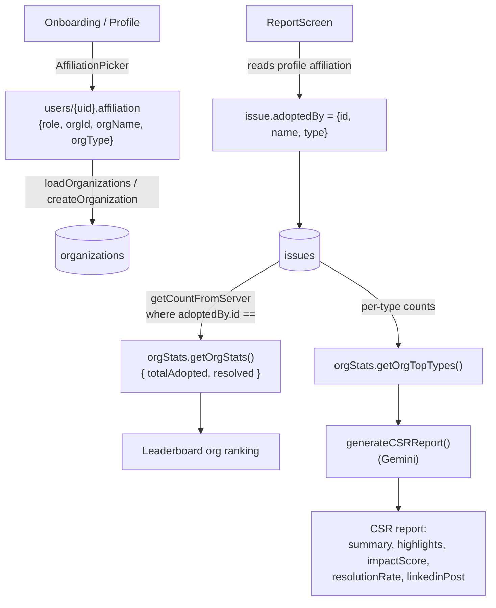

### 4.6 Journalist Flow

`JournalistDashboard` loads the **100 oldest unresolved** issues (oldest = most
newsworthy), filters to **story-ready** (≥ 3 of 6 signals via `story.storyCriteria`),
supports a **48-hour exclusive claim** (enforced in Firestore rules), and generates a
**press release** (Gemini, with a deterministic fallback).

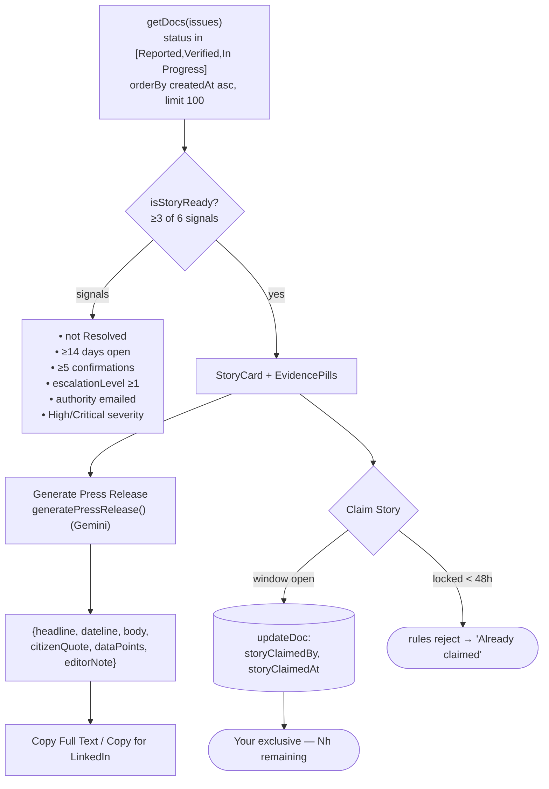

### 4.7 Representative Accountability Flow

Every issue is auto-tagged at creation with the **elected representative responsible for
its ward** (GPS → ward → representative, no user input), and a neutral **scorecard** ranks
representatives purely by **resolution rate**. Ward/representative data loads at runtime
from the `representatives` collection (open-data import — §6.6) via
`utils/representatives.js` (`loadRepresentatives`, cached, swapped into the synchronous
helpers); the built-in list in `constants/representatives.js` is the fallback. Helpers are
pure: `getWardRepresentative(lat,lng)` (Euclidean radius, with `getRepresentativeForCity`
fallback) and `calculateScorecard(issues)`.

> **Neutral by design:** individual representative *performance* only — no party
> colors/logos, no endorsements; `party` is a metadata label and resolution rate is the
> sole ranking metric.

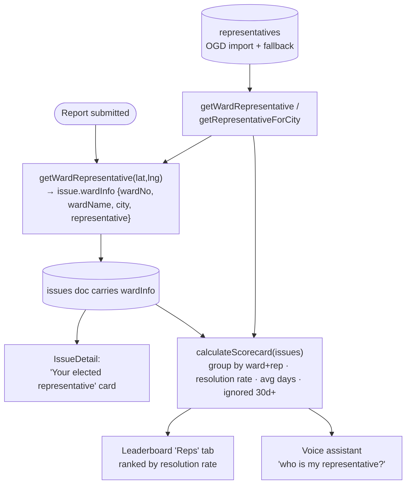

Surfaces: the **IssueDetail** representative card, the **Leaderboard → Reps** scorecard
(resolution rate, total/resolved, avg days, *ignored 30+ days*, Responsive /
Low-accountability badges), and the **voice assistant** (answers "who is responsible for
my area?" from the user's live GPS). Issues that predate `wardInfo` are mapped on-the-fly
from their GPS, so the scorecard covers all existing data.

### 4.8 Voice Assistant Flow

A global floating assistant (`components/VoiceAssistant.jsx`) answers spoken or typed
civic questions in **English / Hindi**, grounded in live data. Speech-to-text and
text-to-speech run **on-device** via the Web Speech API; only the transcribed text + an
**aggregate** civic-data context reach Gemini (never audio, uids, emails, or raw GPS).

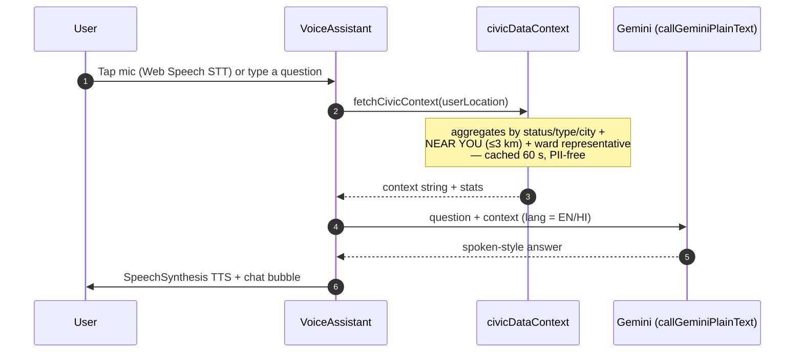

- **Data context** (`utils/civicDataContext.js`): live aggregates by status/type/city, a
  **NEAR YOU** block (issues within 3 km of the user's GPS), and the user's **ward
  representative** + record — built on demand, cached 60 s, no PII.
- **Language** (`constants/voiceLang.js`): EN / HI — switches STT locale, TTS voice,
  Gemini answer language, suggested questions, and every panel string.
- **Routing:** answers go through `callGeminiPlainText` → `fetchAI`, so the assistant
  honours the same n8n-proxy / direct-Gemini dispatch order as the agents.
- **Privacy:** voice is processed locally; the panel states "Voice processed on-device.
  No audio stored."

---

## 5. Database Schema (Cloud Firestore)

Nine collections. App documents are written client-side; the demo dataset
(issues/users/orgs) is bulk-loaded via `scripts/importExcel.mjs` and ward/representative
reference data via `scripts/importRepresentatives.mjs` — both Admin SDK. Integrity is
enforced by `firestore.rules` (§8). Timestamps are Firestore `serverTimestamp()` unless
noted ISO.

### 5.1 `issues/{issueId}` — the central document

| Field | Type | Purpose |
|---|---|---|
| `userId` | string | Reporter uid (owner; gates writes) |
| `userName` / `userPhoto` / `userEmail` | string / string\|null / string | Reporter identity snapshot |
| `complaintId` | string | Human reference, e.g. `JS-BLR-2026-00042` |
| `photoUrl` | string | **Inline base64** data URL (compressed, < 900 KB) or '' |
| `mediaType` | string | `'photo'` \| `'video'` |
| `videoUrl` / `videoDuration` | string\|null / number\|null | Cloudinary URL + seconds (video reports) |
| `issueType` | string | Category (Pothole, Garbage, … 20+ taxonomy) |
| `severity` | string | `Low` \| `Medium` \| `High` \| `Critical` |
| `description` | string | AI 2-sentence description |
| `department` | string | AI-suggested responsible department |
| `complaintText` | string | Composed formal complaint letter |
| `legalRight` | string | Relevant citizen right (Indian law) |
| `isGenuine` | boolean | Agent 1 guard-rail verdict |
| `confidence` | number | Agent 1 confidence 0–100 |
| `tags` | string[] | Social hashtags |
| `isDuplicate` / `originalIssueId` | boolean / string\|null | Duplicate linkage |
| `location` | `{lat, lng}` | GPS coordinates (geofence + map) |
| `locationText` | string | Reverse-geocoded address |
| `city` | string | Derived city bucket |
| `adoptedBy` | `{id, name, type}`\|null | Corporate/campus adoption tag |
| `ward` | string | Ward (optional) |
| `wardInfo` | `{wardNo, wardName, city, representative}`\|null | Elected-rep tag (GPS→ward) powering the accountability scorecard |
| `status` | string | `Reported`→`Verified`→`In Progress`→`Resolved` |
| `statusHistory` | array | `{status, changedAt(ISO), changedBy, note}` (append via `arrayUnion`) |
| `confirmations` | number | Community vote count (starts 1) |
| `confirmedBy` | string[] | uids who confirmed (one vote each) |
| `pressureScore` | number | Pressure meter (+10 per confirmation) |
| `escalationLevel` | number | 0–3 (see `ESCALATION_LEVELS`) |
| `wallOfShame` | boolean | True at ≥ 30 days open |
| `isRecurring` / `recurringCount` / `previousReportIds` | boolean / number / string[] | Recurrence tracking |
| `socialConsent` | string | `'tag'` \| `'anonymous'` \| `'none'` |
| `userXHandle` | string | Handle to mention when consent = tag |
| `xPosted` / `xPostUrl` | boolean / string\|null | Social post state |
| `linkedinPosted` / `linkedinPostUrl` | boolean / string\|null | Social post state |
| `socialReach` | number | Aggregate reach |
| `socialQueued` | boolean | Tx flag — ensures one social trigger |
| `routedTo` | object | Agent 3 result `{departmentName, departmentCode, wardOffice, officerTitle, emailSubject, urgencyLevel, slaHours, escalationPath, emailSent, emailSentAt}` |
| `prediction` | object | Agent 4 result `{priority_score, predicted_days, escalation_risk, recommendation, confidence, factors[]}` |
| `esgScore` | object\|null | Agent 6 result (post-resolution) — per-pillar `e_score`/`s_score`/`g_score` (+ impact + metric), blended `overall_esg` (E×0.35+S×0.35+G×0.30), `sdg_tags`, `sdg_names`, `highlight` |
| `esgScoredAt` | timestamp\|null | When Agent 6 scored the resolved issue |
| `resolutionPhotoUrl` | string\|null | Inline base64 fix photo |
| `resolutionVerified` | boolean | Agent 5: genuine && resolved |
| `resolutionGenuine` | boolean | Agent 5 genuineness |
| `resolutionConfidence` | number | Agent 5 confidence |
| `resolutionNote` | string | Agent 5 reasoning |
| `resolvedAt` | timestamp\|null | When resolved |
| `resolutionCelebrated` | boolean | Idempotent +25 award guard |
| `rtiGenerated` / `rtiDocUrl` | boolean / string\|null | RTI state |
| `storyClaimedBy` / `storyClaimedAt` | string\|null / timestamp\|null | Journalist 48 h exclusive |
| `createdAt` / `updatedAt` | timestamp | Lifecycle timestamps |

### 5.2 `users/{uid}` — private profile (owner read/write only)

| Field | Type | Purpose |
|---|---|---|
| `uid` | string | Firebase Auth uid |
| `displayName` / `email` / `photoURL` | string / string\|null / string\|null | Identity |
| `authMethod` | string | `google` \| `anonymous` \| `email` |
| `civicScore` | number | Gamification score |
| `issuesReported` / `issuesVerified` / `issuesResolved` / `issuesShared` | number | Activity counters |
| `esgIssuesResolved` / `totalPeopleImpacted` | number | ESG impact counters (Agent 6, via `increment()`); seeded 0 |
| `sdgsContributed` | string[] | UN SDGs the user has contributed to (Agent 6, via `arrayUnion()`); seeded `[]` |
| `rtiFiled` | number | RTI requests filed; seeded 0 |
| `badges` | string[] | Earned badge ids (`BADGE_CONDITIONS`, **10 badges** — incl. `civic_authority`: civicScore ≥ `AUTHORITY_THRESHOLD` (100), the gate that unlocks authority powers) |
| `level` | string | Tier name (`LEVEL_THRESHOLDS`) |
| `streak` / `lastActiveDate` | number / string(YYYY-MM-DD) | Daily streak |
| `xHandle` / `linkedinUrl` / `city` | string | Optional profile fields |
| `affiliation` | `{role, orgId, orgName, orgType}` | Adoption affiliation |
| `notificationsSeenAt` | string(ISO)\|null | Notification read marker |
| `onboardingComplete` | boolean | Onboarding gate |
| `createdAt` / `lastSeen` | timestamp | Lifecycle |

### 5.3 `publicProfiles/{uid}` — public leaderboard mirror

| Field | Type | Purpose |
|---|---|---|
| `displayName` / `photoURL` | string / string\|null | Public identity |
| `civicScore` | number | Mirrored score (drives Wall of Fame) |
| `issuesReported` | number | Mirrored count |
| `updatedAt` | timestamp | Sync time |

> Why a mirror? `users/{uid}` holds private data and is owner-read-only, so the
> leaderboard reads this display-only mirror. Kept in sync client-side via
> `publicProfile.js` (`syncPublicProfile`, `mirrorPublicIdentity`, `bumpPublicProfile`).

### 5.4 `organizations/{orgId}` — adopted-zone orgs (public read)

| Field | Type | Purpose |
|---|---|---|
| `id` / `name` / `type` | string / string / `company`\|`college` | Identity |
| `zone` | `{lat, lng, radiusKm}` | Adoption zone |
| `zoneName` | string | Human zone label |
| `logo` | string\|null | Logo URL |
| `memberCount` | number | Declared org size |
| `badge` | string | `Civic Champion` / `Active Adopter` / `Civic Campus` |
| `color` | string | Accent hex |
| `seededAt` | timestamp | Seed time |

### 5.5 `agents_log/{logId}` — per-agent audit log (public read)

| Field | Type | Purpose |
|---|---|---|
| `issueId` | string | Related issue |
| `agentName` | string | `issue_analyzer` \| `duplicate_detector` \| `authority_router` \| `resolution_predictor` \| `resolution_verifier` \| `esg_scorer` |
| `input` / `output` | object\|null | Call payloads |
| `processingTimeMs` | number | Latency |
| `success` | boolean | Outcome (aggregated by `useAgents`) |
| `error` | string | Message on failure |
| `geminiModel` | string | Model that served the call |
| `createdAt` | timestamp | Log time |

### 5.6 `agent_runs/{runId}` — orchestrated pipeline traces (public read)

| Field | Type | Purpose |
|---|---|---|
| `issueId` | string | Related issue |
| `issueType` / `severity` / `locationText` | string | Snapshot |
| `steps` | array | Per-agent `{agent, name, status, summary, detail, confidence}` |
| `durationMs` | number | Total pipeline time |
| `createdAt` | timestamp | Run time |

### 5.7 `authorities/{uid}` — authority allowlist

`{ uid, enrolledAt, demo }` — presence gates the trust-sensitive issue fields (§8).
Self-enroll (create) is itself gated: the rules require the user's own
`users/{uid}.civicScore` ≥ 100 (the **Civic Authority** badge / `AUTHORITY_THRESHOLD`),
so authority status is earned, not free.

### 5.8 `meta/{docId}` — seed marker (vestigial)

`meta/seed` — a public-read marker from the original in-app seeder. The browser seeders
have been removed; real data is now bulk-imported via the Admin SDK
(`scripts/importExcel.mjs`, `scripts/importRepresentatives.mjs`). Kept for compatibility.

### 5.9 `representatives/{wardId}` — ward → elected representative (public read)

Curated reference data sourced from open data (§6.6) and ingested via the Admin SDK
(`scripts/importRepresentatives.mjs`); loaded at runtime by `utils/representatives.js`
with a built-in fallback (`constants/representatives.js`). Write-locked in the rules.

| Field | Type | Purpose |
|---|---|---|
| `wardNo` | string\|number | Ward identifier (document id) |
| `name` | string | Ward / area name |
| `city` | string | City / municipal corporation |
| `center` | `{lat, lng}` | Ward centroid (from the boundary polygon) |
| `radiusKm` | number | Approx ward radius (bbox-derived) |
| `representative` | `{name, party, since, phone}` | Elected representative (`party` = neutral label) |

### Composite indexes (`firestore.indexes.json`)

`issues`: `userId+createdAt↓`, `status+issueType`, `severity+createdAt↓`,
`status+createdAt↓`, `status+createdAt↑`, `adoptedBy.id+status`,
`adoptedBy.id+issueType`. `agents_log`: `agentName+success`.

---

## 6. API Integrations

### 6.1 Google Gemini (Google AI Studio) — primary AI

All AI routes through `utils/gemini.js → fetchAI()`. **Dispatch order:** n8n AI proxy
(if `VITE_N8N_AI_WEBHOOK` set) → direct Gemini chain (default).

- **Endpoint:** `https://generativelanguage.googleapis.com/v1beta/models/{model}:generateContent?key=…`
- **Model fallback chain** (falls through on 404/429/503):
  `gemini-2.5-flash` → `gemini-2.5-flash-lite` → `gemini-2.0-flash`
- **Modes:** text (`callGeminiText`), vision (`callGeminiVision`, image compressed to
  640 px / q0.4), and native **function-calling** (`callGeminiVisionFunction`, `mode: ANY`).
- **Config:** `temperature 0.1`. JSON responses fence-stripped (` ```json `) before parse.
- **Used by:** all 6 agents + `generateRTI`, `generateXCaption`, `generateCityInsights`,
  `generateCSRReport`, `generatePressRelease`, `generateCorporateESGReport`
  (`callGeminiPlainText` — SEBI-BRSR-style report), and the **voice assistant**
  (`callGeminiPlainText` — raw-text answers over the live civic context).

### 6.2 Google Maps Platform

- **Maps JavaScript API** (`utils/googleMaps.js`, single shared `<script>`): markers
  (severity-colored, pulsing Critical), `Circle` adopted zones (tricolor + animated
  Ashoka Chakra), clustering, `InfoWindow` — used by `MapScreen` and `LocationPicker`.
- **Geocoding API** (`utils/geocode.js`): `reverseGeocode(lat,lng)` (used by
  `useGeoLocation` + `LocationPicker`) and `forwardGeocode(address)` (used by
  `AffiliationPicker` when adding an org). Both degrade to coordinate strings / null.
- **Key:** `VITE_GOOGLE_MAPS_KEY`.

### 6.3 Firebase (Google) services

| Service | Usage |
|---|---|
| **Firebase Auth** | Google popup, Anonymous (guest), Email/Password (`firebase.js`) |
| **Cloud Firestore** | All data; `persistentLocalCache` (IndexedDB, multi-tab) for instant revisits |
| **Firebase Hosting** | SPA delivery, `**`→`/index.html` rewrite, COOP header for auth popups |
| ~~Firebase Storage~~ | **Not used** — photos inline base64, videos on Cloudinary |

### 6.4 n8n Cloud webhooks (`utils/n8n.js`)

`triggerN8N(name, payload)` is fire-and-forget and try/catch-wrapped — a webhook
failure never affects the app.

| Workflow key | Env var | Trigger | Purpose |
|---|---|---|---|
| `issue_intelligence` | `VITE_N8N_ISSUE_WEBHOOK` | every new report | Issue intelligence / logging / dashboards |
| `authority_email` | `VITE_N8N_AUTH_WEBHOOK` | Agent 3 routing | Formal complaint email to the department (HTTP node) |
| `social_post` | `VITE_N8N_SOCIAL_WEBHOOK` | Critical / ≥5 confirmations | Post to `@JanaShaktiApp` (X / LinkedIn) |
| `escalation` | `VITE_N8N_ESCALATE_WEBHOOK` | level increase | Escalation + Wall-of-Shame alert |
| *(optional AI proxy)* | `VITE_N8N_AI_WEBHOOK` | every AI call | Keeps the model API key server-side; returns `{text}` |

### 6.5 Cloudinary (third-party)

Unsigned upload of short (≤ 10 s) report videos (`utils/cloudinary.js`):
`POST https://api.cloudinary.com/v1_1/{cloud}/video/upload`. Returns `{secure_url,
duration, publicId}`; only the URL is stored. Helpers `videoPosterUrl` (poster frame)
and `cloudinaryThumb` (on-the-fly downscale). Config: `VITE_CLOUDINARY_CLOUD_NAME`,
`VITE_CLOUDINARY_UPLOAD_PRESET`.

### 6.6 Open-data sourcing — elected representatives (offline import)

Ward + representative data is ingested **offline** into the `representatives` collection
via the Admin SDK (`scripts/importRepresentatives.mjs`) — no live government API exposes
ward corporators *with* map boundaries, and a browser couldn't call one anyway (CORS, no
backend). The script accepts a flat CSV/XLSX/JSON, **or** a ward-boundary **GeoJSON**
(e.g. DataMeet *Municipal_Spatial_Data*) which it converts to a centroid + radius, with an
optional `--names=` corporator CSV joined by ward number. Recommended sources: **DataMeet**
(geometry), a per-city corporator list / **MyNeta-ADR** (names), **lgdirectory.gov.in**
(official ward codes). Coverage is per-city; the built-in list is the runtime fallback.

---

## 7. Technology Credits

| Technology | Version | License | Used for |
|---|---|---|---|
| **React** | ^18.3.1 | MIT | UI framework (JSX, hooks, lazy/Suspense) |
| **React DOM** | ^18.3.1 | MIT | DOM renderer |
| **Vite** | ^5.4.0 | MIT | Build tool + dev server |
| **@vitejs/plugin-react** | ^4.3.0 | MIT | React fast-refresh / JSX transform |
| **vite-plugin-pwa** | ^0.20.0 | MIT | PWA manifest + Workbox service worker |
| **react-router-dom** | ^6.23.0 | MIT | Client-side routing |
| **recharts** | ^2.12.0 | MIT | Analytics charts (pie / bar / line) |
| **lucide-react** | ^0.383.0 | ISC | Icon system (no emoji UI icons) |
| **firebase** (web SDK) | ^10.12.0 | Apache-2.0 | Auth + Firestore + Hosting |
| **Google Gemini 2.5 Flash** | API (AI Studio) | Google API ToS | AI agents (vision, text, function-calling) |
| **Google Maps JavaScript API** | API | Google Maps ToS | Maps, markers, adopted zones |
| **Google Maps Geocoding API** | API | Google Maps ToS | Reverse + forward geocoding |
| **n8n Cloud** | 14-day trial | Sustainable Use License | Automation workflows |
| **Cloudinary** | API (free tier) | Cloudinary ToS | Short report video hosting |
| **firebase-admin** *(dev)* | ^12.7.0 | Apache-2.0 | Admin-SDK data import (`importExcel`, `importRepresentatives`) |
| **sharp** *(dev)* | ^0.35.2 | Apache-2.0 | Icon/image generation |
| **xlsx** *(dev)* | ^0.18.5 | Apache-2.0 | Excel dataset import |
| **vitest** *(dev)* | ^2.1.0 | MIT | Unit tests (utils, agents) |

*Build language: **JSX only** (no TypeScript). Theme: a strict palette derived from the
JanaShakti holographic-fist logo (cyan primary `#00d4ff`, green secondary `#16a34a`).*

---

## 8. Security Architecture

### 8.1 Authentication

Three methods via Firebase Auth (`firebase.js`): **Google** popup, **Anonymous**
(guest), **Email/Password**. On first sign-in `createUserProfile` writes full defaults;
returning users refresh identity fields **only** (never re-zero score/badges/streak).
A public identity mirror is written to `publicProfiles/{uid}`.

### 8.2 Firestore Security Rules (`firestore.rules`)

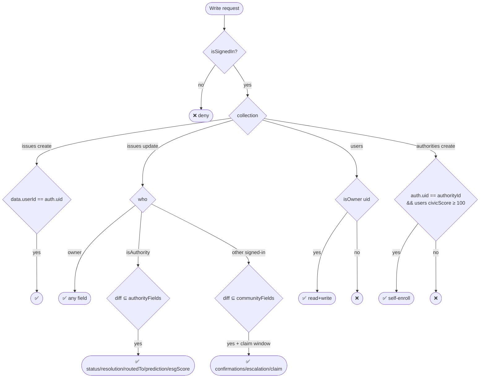

**Field-level authorization on `issues`** (the core control):

- **Owner** (`resource.data.userId == auth.uid`) — may write any field on their issue.
- **Authority** (uid in `/authorities`) — may write **only** `authorityFields`: the
  status pipeline, resolution proof (`status, statusHistory, resolutionPhotoUrl,
  resolutionVerified/Genuine/Confidence/Note, resolvedAt, resolutionCelebrated`), and
  the agent outputs (`routedTo, prediction, esgScore, esgScoredAt`) — plus community
  fields.
- **Any signed-in user** — limited to **`communityFields`** (`confirmations,
  confirmedBy, pressureScore, socialQueued, escalationLevel, wallOfShame, updatedAt,
  storyClaimedBy, storyClaimedAt`). A story claim must additionally satisfy
  `claimWindowOpen()` — unclaimed or the prior 48 h window expired — enforced via
  `diff().affectedKeys().hasOnly(...)` and a time check (`request.time`).
- **Delete** — owner only.

**Other collections:** `users` owner-only read/write; `publicProfiles` /
`organizations` / `agents_log` / `agent_runs` / `meta` public-read + signed-in-write
(signed-in-write demo posture — real data is Admin-SDK imported; production-harden per the
notes below); `representatives` public-read, **write locked** (Admin-SDK import only —
curated reference data); `authorities` public-read, a signed-in user may create
**only their own** uid doc (`update`/`delete` forbidden) **and only once their
`users/{uid}.civicScore` ≥ 100** — i.e. they have earned the **Civic Authority**
badge (`AUTHORITY_THRESHOLD`, mirrored in `constants/issueTypes.js`). The create rule
reads the user's own profile via
`get(/databases/$(database)/documents/users/$(authorityId)).data.get('civicScore', 0) >= 100`,
so authority self-enrollment — and the resulting status/resolution write rights gated by
`isAuthority()` — is **earned**, not free.

> **Honest-user enforcement (demo):** civic scores live on the owner-writable
> `users/{uid}` doc, so a determined user could inflate their own score to clear the
> gate. This is an honest-user control for the demo; production would compute scores
> **server-side** (or provision authorities via Admin SDK / custom claims) so the gate
> can't be self-granted.
>
> **Production hardening notes** (documented inline in the rules): lock `publicProfiles`
> to `isOwner`, `organizations`/`meta` to `if false` (Admin-SDK seeding), and provision
> `authorities` via Admin SDK / custom claims with self-enroll removed.

### 8.3 API-key management

All secrets live in `import.meta.env.VITE_*` (`.env`, never committed — `.env.example`
is the template). Keys are restricted by service. For zero client-side key exposure, an
optional **n8n AI proxy** (`VITE_N8N_AI_WEBHOOK`) moves the model key server-side, and
Cloudinary uses an **unsigned** preset (no secret in the bundle).

### 8.4 Trust & abuse controls

- **AI guard rail** — Agent 1 rejects non-civic images (`is_genuine:false` / confidence
  < 40); `isReportBlocked` blocks the submit (defense-in-depth in UI + at write time).
- **Geofenced verification** — verifying requires a real GPS fix **within 500 m**
  (Haversine), preventing remote vote-stuffing.
- **One vote per user** — `confirmedBy[]` + transactional `confirmIssue` (idempotent).
- **Earned authority powers** — status/resolution write rights are gamification-gated:
  a user can self-enroll into `/authorities` only once `civicScore` ≥
  `AUTHORITY_THRESHOLD` (100 — the **Civic Authority** badge), enforced both in the UI
  (locked card + progress bar in `AuthorityDashboard`) and in the rules' `authorities`
  create check. Acting on issues then earns the authority civic points via
  `CIVIC_SCORE_POINTS.AUTHORITY_ACTION` (+5/status advance) and `AUTHORITY_RESOLVE`
  (+15/resolve). Community confirm/verify (the geofenced citizen +5) is a separate,
  unchanged path.
- **Exactly-once social** — the `socialQueued` flag is set inside the confirm
  transaction so concurrent verifiers can't double-post.
- **Resolution verification** — Agent 5 flags fake/unrelated fix photos (AI-verified
  badge vs. "flagged for review"), without ever blocking a legitimate resolution.
- **Privacy-safe exports** — every dashboard Excel export (`utils/exportToExcel.js`) is
  anonymized: never uids, emails, phones, photo URLs, social handles, or coordinates;
  names are initialled and `confirmedBy` / story claims are reduced to counts / Yes-No.

### 8.5 Social consent model

Posts originate only from the platform's own `@JanaShaktiApp` accounts — **never** user
accounts, and there is **no user OAuth**. Per-issue `socialConsent` governs mentions:

| Value | Behaviour |
|---|---|
| `tag` | Post **and** mention the user's `@handle` |
| `anonymous` | Post **without** any mention |
| `none` | Do **not** post (hard-blocks the `social_post` trigger) |

---

## 9. AI Testing Pipeline (Quality Engineering)

Beyond the runtime agents, JanaShakti ships a **Gemini-powered test pipeline** —
three Node dev agents (`tests/agents/`) that write, run, and assess the test suite.
They call Gemini directly (the same `VITE_GEMINI_API_KEY`, same policy model list as
the app) and are wired to npm scripts.

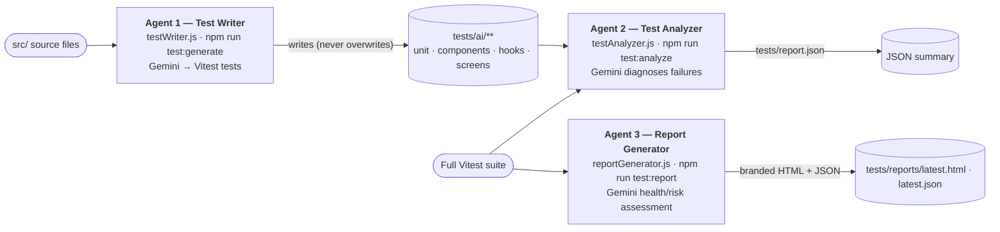

| Agent | Script | Gemini role | Output |
|---|---|---|---|
| **1 · Test Writer** | `test:generate` | Reads ~36 source targets (utils, constants, components, hooks, screens, theme) and generates Vitest + Testing-Library cases per a type-specific prompt (unit / component / hook / screen-smoke) | Test files in `tests/ai/{unit,components,hooks,screens}` — **existing files are never overwritten**, so manual fixes survive |
| **2 · Test Analyzer** | `test:analyze` | Runs the full suite; on failures, classifies each root cause `MOCK_ISSUE \| IMPORT_ERROR \| LOGIC_BUG \| TEST_ISSUE` with a one-line fix + a 2–3 sentence health assessment | `tests/report.json` (`passed/failed/passRate/status`) |
| **3 · Report Generator** | `test:report` | Runs suite + coverage; asks Gemini for a health assessment, top-3 coverage gaps, biggest production risk, and one quality recommendation | Branded HTML + JSON in `tests/reports/` (`latest.html` / `latest.json`) |

**Model chain:** `gemini-2.5-flash → gemini-2.5-flash-lite → gemini-2.0-flash-lite`
(retries on 429/500/503). **Isolation:** AI-generated tests live under `tests/ai/**`
and are **excluded from `npm test`** (which runs only the deterministic `src/**` +
`tests/unit` suite), so a flaky AI test can never red the main suite. `npm run test:full`
chains Agent 1 → Agent 3. Vitest config + coverage (`@vitest/coverage-v8`,
`json-summary`) is in `vite.config.js`.

**Latest run:** 410 tests passing (100%) across 52 files — 18 deterministic
(`src/**` + hand-written `tests/unit/core`) + 34 Gemini-generated under `tests/ai/`
(unit · components · hooks · screen-smoke) — at ~48% line / 41% function / 70% branch
coverage (screens covered at the smoke / render-without-crash level). Snapshot:
`tests/reports/latest.html`.

---

## Appendix — Google technology footprint (collaboration highlight)

This project is built end-to-end on **Google's platform** — a deliberate showcase for
the Google-collaborated hackathon track:

| Google product | Where it powers JanaShakti |
|---|---|
| **Gemini 2.5 Flash** (Google AI Studio) | The entire 6-agent intelligence: photo analysis, duplicate detection, authority routing, resolution prediction, resolution verification, and post-resolution ESG impact scoring (E/S/G pillars + UN SDG mapping) — plus RTI letters, press releases, CSR reports, SEBI-BRSR-style corporate ESG reports, social captions, and city insights. Uses Gemini **vision**, **text**, and native **function-calling**. |
| **Firebase Authentication** | Google / Anonymous / Email sign-in. |
| **Cloud Firestore** | Real-time database of record (8 collections) with offline IndexedDB persistence. |
| **Firebase Hosting** | Global SPA + PWA delivery with SPA rewrites and auth-popup COOP headers. |
| **Google Maps JavaScript API** | Live issue map, severity markers, corporate/campus adopted-zone overlays, draggable location picker. |
| **Google Maps Geocoding API** | Reverse-geocoding GPS to addresses and forward-geocoding org addresses. |
| **Firebase Security Rules** | Field-level, zero-backend authorization model. |

*Net result: a production-shaped civic-tech PWA where Google AI + Google Cloud do all
the heavy lifting, with no custom server to operate.*

---

*Architecture Reference · source of truth: `janashakti/src` + `firestore.rules` +
`firestore.indexes.json` + `firebase.json`.*

*JanaShakti — जनशक्ति — People's Power*
*Vibe2Ship 2026 — PS2: Community Hero*
