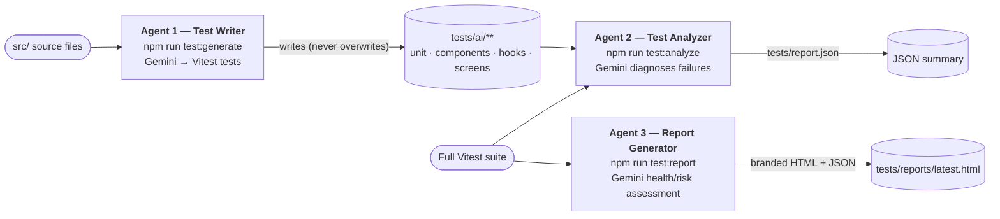
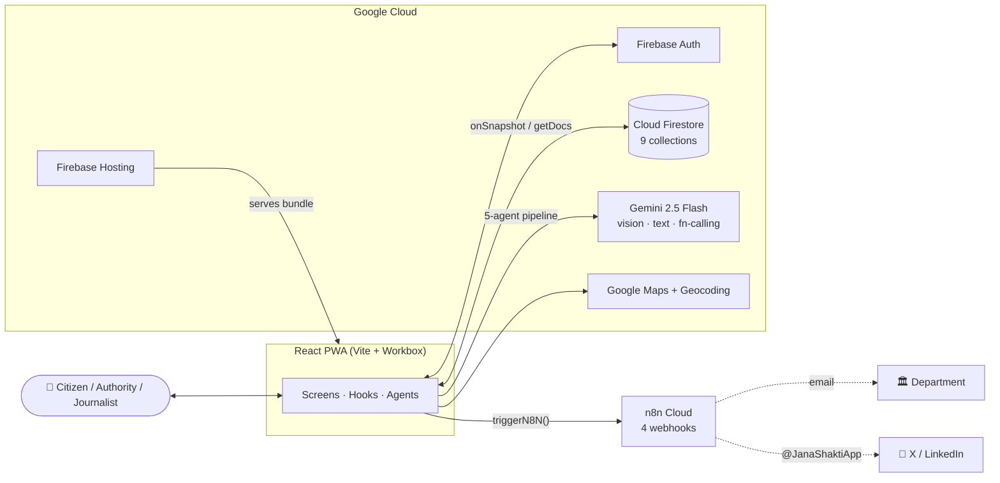

# JanaShakti — Hackathon Submission

> **जनशक्ति — People's Power**
> Vibe2Ship 2026 · PS2 — Community Hero · Solo developer · Submitted on BlockseBlock.

---

## Problem Statement Selected

**PS2 — Community Hero:** Build an AI-powered solution that addresses a real community challenge and empowers people to create positive change.

---

## Solution Overview

JanaShakti turns the everyday frustration of broken civic infrastructure into organised, accountable action. A citizen photographs a pothole, dead streetlight, or overflowing bin; a **5-agent Google Gemini pipeline** instantly classifies it, scores its severity, drafts a formal complaint, identifies the citizen's legal rights, detects duplicates, routes it to the correct municipal department (emailing them via n8n), and predicts a resolution timeline. The community then verifies the issue under a GPS geofence, building visible pressure; authority powers to advance and resolve issues are **earned through civic points** (the Civic Authority badge unlocks at 100 points), not granted freely. If it's ignored, a time-based engine **auto-escalates** it from Ward Officer to Department Head to Commissioner to Media at 7/14/30 days. JanaShakti uniquely closes the accountability loop: it generates **RTI applications**, ranks **elected representatives** by real resolution rate, equips **journalists** with story-ready feeds and AI press releases, lets **companies and colleges** adopt civic zones with auto-generated CSR reports, and answers questions through a bilingual **Gemini voice assistant** grounded in live data. Once an issue is resolved, a **6th Gemini agent** scores its **ESG impact** across Environmental, Social, and Governance pillars and maps it to the **UN Sustainable Development Goals** — keeping civic action not just accountable, but measurable — all on Google's stack with **no custom backend**.

*(~190 words)*

---

## Key Features

### 1. AI-Powered Reporting
- **Gemini Vision analysis** — photo → issue type, severity, description, department, complaint letter, legal right, confidence. *Files a correctly-classified complaint in seconds.*
- **AI guard rail** — rejects non-civic images (selfies, food, memes). *Keeps the civic feed clean and abuse-free.*
- **Self-correcting analyzer** — re-examines low-confidence photos once. *Recovers good reports from poor images.*
- **Manual fallback** — a form when AI is down. *A report is never lost.*
- **Complaint ID** — `JS-CITY-YEAR-SEQUENCE`. *Citizen-friendly tracking reference.*
- **GPS + reverse geocoding** — Google Geocoding turns coordinates into an editable address. *Accurate location, zero typing.*

### 2. 4-Agent Intelligence Pipeline (+ a 5th verifier)
- **Agent 1 Analyzer / Agent 2 Duplicate & Recurrence Detector / Agent 3 Authority Router / Agent 4 Resolution Predictor**, orchestrated so each agent's output feeds the next. *Coordinated reasoning, not isolated calls.*
- **Agent 5 Resolution Verifier** — judges fix photos. *Stops fake "resolved" claims without ever blocking a real one.*
- **Live pipeline trace + `agents_log` / `agent_runs` logging.** *Total transparency on the Agents Showcase.*
- **Model fallback chain.** *Rate-limit resilience.*

### 3. Community Pressure System
- **Pressure Meter, geofenced verification (+5), auto-post at 5 confirmations, Wall of Shame (30+ days).** *Collective demand becomes visible and self-amplifying.*

### 4. Automated Accountability (n8n)
- **Auto-escalation (7/14/30 days), authority email, escalation alerts, SLA tracking per department.** *Ignored complaints climb the chain automatically.*

### 5. Legal Empowerment
- **AI-generated RTI applications (RTI Act 2005), formal complaint letters, contextual legal rights.** *Hands citizens real legal instruments.*

### 6. Civic Gamification
- **Civic score, 10 badges, 5 levels, daily streaks.** *Turns one-off reporters into repeat civic guardians.* The **Civic Authority** badge unlocks at **100 points**, granting authority powers (verify / resolve), which themselves award points — a virtuous cycle.

### 7. Corporate & College Adoption
- **Zone adoption, auto-tagging, live org stats, AI CSR reports + LinkedIn posts, inter-college competition.** *Makes CSR and campus civic-duty measurable.*

### 8. Media Pipeline
- **Journalist dashboard (story-ready filter), AI press releases, 48h exclusive claims, evidence strength meter.** *Connects civic data to the fourth estate.*

### 9. Social Amplification
- **X / WhatsApp / LinkedIn / Facebook / Telegram share links, consent model, platform-only auto-posting.** *One tap turns a network into pressure, with privacy by design.*

### 10. Representative Accountability (self-enrolled)
- **Reps self-enrol — "claim your ward"** (one per ward, declare a **civic role** — corporator / RWA / volunteer / officer / NGO / independent; party optional & never ranked), GPS→ward tagging, resolution-rate ranking, plus a neutral **by-role aggregate**. Self-declared & community-flagged — *not an official record*. *No open dataset exists for this, so the app becomes the source.*

### 11. Voice Assistant
- **Gemini voice Q&A over live PII-free data, English/Hindi, on-device speech.** *Anyone can simply ask "who is responsible near me?"*

### 12. Privacy-Safe Data Export
- **Anonymized Excel on 4 dashboards (allowlist sanitization, name masking, aggregate summary).** *Open transparency without exposing a single citizen.*

### 13. AI Testing Pipeline
- **3 Gemini agents that write, run, and assess the test suite into a branded report.** *AI-assured quality engineering.*

### 14. ESG & SDG Impact Intelligence
- **Post-resolution ESG scoring across Environmental / Social / Governance, UN SDG mapping, Analytics ESG tab + city ESG grade, Profile ESG badges, and a corporate SEBI-BRSR-style ESG report.** *Turns resolved issues into measurable, sustainability-aligned impact.*

Latest run: **410 tests passing (100%)** across 52 files (18 deterministic + 34 AI-generated) at ~48% line / 70% branch coverage. Models: `gemini-2.5-flash → gemini-2.5-flash-lite → gemini-2.0-flash-lite`.

---

## Technologies Used

| Technology | Version | Purpose in JanaShakti |
|---|---|---|
| **React** | ^18.3.1 | UI framework — JSX, hooks, `lazy`/`Suspense` |
| **React DOM** | ^18.3.1 | DOM renderer |
| **Vite** | ^5.4.0 | Build tool + dev server |
| **@vitejs/plugin-react** | ^4.3.0 | JSX transform / fast refresh |
| **vite-plugin-pwa** | ^0.20.0 | Installable PWA + Workbox offline service worker |
| **react-router-dom** | ^6.23.0 | Client-side routing (12 routes) |
| **recharts** | ^2.12.0 | Analytics charts (pie / bar / line) |
| **lucide-react** | ^0.383.0 | Icon system (no emoji UI icons) |
| **firebase** (web SDK) | ^10.12.0 | Auth + Cloud Firestore + Hosting |
| **Google Gemini 2.5 Flash** | API (AI Studio) | All AI: 5 agents + RTI, press release, CSR, insights, captions, voice |
| **Google Maps JavaScript API** | API | Map, severity markers, adopted-zone overlays |
| **Google Maps Geocoding API** | API | Reverse + forward geocoding |
| **n8n Cloud** | 14-day trial | 4 automation webhooks (+ optional AI proxy) |
| **Cloudinary** | API (free) | Short report-video hosting (unsigned) |
| **firebase-admin** *(dev)* | ^12.7.0 | Admin-SDK data import |
| **xlsx** *(dev)* | ^0.18.5 | Privacy-safe Excel export / import |
| **sharp** *(dev)* | ^0.35.2 | Icon / image generation |
| **Vitest + Testing Library + jsdom** *(dev)* | ^2.1.0 / ^16.3.2 / ^29.1.1 | Test suite + AI testing pipeline |

**Language:** JSX only — zero TypeScript.

---

## Google Technologies Utilized

> This is the heart of the submission. JanaShakti is built **end-to-end on Google's platform** — Gemini does all the intelligence, Firebase is the entire backend, and Google Maps powers the spatial layer. Every usage below is real and traceable to source.

### 1. Gemini AI (Google AI Studio)

All Gemini calls route through `fetchAI()` in `utils/gemini.js` and use Gemini's **vision**, **text**, and native **function-calling** modes. Concrete usages:

| # | Usage | What Gemini does |
|---|---|---|
| 1 | **Agent 1 — Issue Analyzer** | Vision + function-calling (`report_civic_issue` typed schema). Returns issue type, severity, 2-sentence description, responsible department, a 3-paragraph complaint, the relevant Indian-law citizen right, predicted days, a genuineness/guard-rail verdict, confidence, and hashtags. Self-retries once on low confidence. |
| 2 | **Agent 2 — Duplicate & Recurrence Detector** | Text comparison — given two nearby same-type reports (geo-filtered to ±200 m), Gemini returns `{ isDuplicate, similarity, reasoning }`; flagged duplicate only when similarity > 65%. **Also** runs a deterministic `checkRecurrence`: a *resolved* issue of the same type recurring at the same spot within **365 days** is flagged as a recurrence — the new report links the prior complaint and the authority email carries a "RECURRENCE NOTICE" that the earlier fix didn't hold. |
| 3 | **Agent 3 — Authority Router** | Text — returns the official department name, ward office, officer title to address, a formal **email subject**, urgency level, SLA hours, and escalation path (seeded from `DEPARTMENT_MAP`). |
| 4 | **Agent 4 — Resolution Predictor** | Text — analyses type, severity, city, confirmations, days open, escalation level, and **Agent 3's routed department** to return priority score, predicted days, escalation risk, recommendation, and contributing factors. |
| 5 | **Agent 5 — Resolution Verifier** | Vision — judges whether an uploaded "fix" photo genuinely shows *this* issue resolved (`is_genuine`, `is_resolved`, confidence, reasoning). Flags, never blocks. |
| 6 | **RTI Generator** | Text — tailors the list of information points for a formal **RTI Act 2005** application (the document structure is deterministic; Gemini fills the issue-specific asks). |
| 7 | **Press Release Generator** | Text — returns headline, subheadline, dateline, a 3-paragraph body, an attributable citizen quote, data points, editor's note, and tags. |
| 8 | **CSR Report Generator** | Text — returns a monthly corporate civic-impact report: executive summary, numbered highlights with numbers, impact score, resolution rate, top issue type, recommendation, and a ready LinkedIn post. |
| 9 | **City Insights Generator** | Text — analyses aggregate issue patterns and returns 4 insight cards (Lucide icon + colour + title + one-line body) for the Analytics dashboard. |
| 10 | **X Caption Generator** | Text — drafts an under-260-char tweet tagging civic handles with `#JanaShakti` + a city hashtag. |
| 11 | **Voice Assistant** | Text (`callGeminiPlainText`) — answers spoken/typed civic questions in English/Hindi, grounded in a live, PII-free civic-data context (status/type/city aggregates + "near you" + ward representative). |
| 12 | **Test Writer Agent** | Text — reads source files and generates Vitest + Testing-Library test cases into an isolated `tests/ai/**` tree. |
| 13 | **Test Analyzer Agent** | Text — diagnoses test failures, classifying each `MOCK_ISSUE / IMPORT_ERROR / LOGIC_BUG / TEST_ISSUE` with a one-line fix + health assessment. |
| 14 | **Report Generator Agent** | Text — produces a codebase health/risk assessment and top coverage gaps for the branded HTML/JSON test report. |
| 15 | **Agent 6 — ESG Impact Scorer** | Text — scores a resolved issue across Environmental / Social / Governance (each /10, with a plain-English impact + metric per pillar); the overall score is a deterministic weighted blend (E×0.35 + S×0.35 + G×0.30), and the issue is mapped to UN SDGs with a one-line highlight. |
| 16 | **Corporate ESG Report Generator** | Text — produces a SEBI-BRSR-style corporate ESG report for the Area Adoption / CSR program. |

**Model fallback chain** (verified against the live key, June 2026; falls through on 404/429/503):
`gemini-2.5-flash → gemini-2.5-flash-lite → gemini-2.0-flash` (app) ·
`gemini-2.5-flash → gemini-2.5-flash-lite → gemini-2.0-flash-lite` (Node testing agents).
*All AI routes through `fetchAI`: an optional n8n proxy (keeps the key server-side) can be switched in by env var, with direct Gemini as the default.*

### 2. Firebase Authentication

Three sign-in methods (`firebase.js`):
- **Google** — `signInWithPopup` (popup, COOP-header friendly).
- **Email/Password** — `createUserWithEmailAndPassword` / `signInWithEmailAndPassword`.
- **Anonymous (Guest)** — `signInAnonymously`.

On first sign-in, `createUserProfile` **auto-creates** the user document with full defaults (civic score 0, empty badges, `Newcomer` level, streak, affiliation) and a public leaderboard mirror in `publicProfiles`. Returning users refresh identity fields only — earned score/badges/streak are never reset.

### 3. Cloud Firestore

The entire database of record — **9 collections**, all written client-side, integrity enforced by Security Rules:

| Collection | ~Fields | Notes |
|---|---|---|
| `issues` | ~55 | The central document (report → routing → prediction → resolution → social → story) |
| `users` | ~22 | Private profile (owner-only) |
| `publicProfiles` | 4 | Public leaderboard mirror |
| `organizations` | ~9 | Adopted-zone companies/colleges |
| `agents_log` | ~8 | Per-agent audit log |
| `agent_runs` | ~6 | Orchestrated pipeline traces |
| `representatives` | ~6 | Ward → representative — community self-enrolled ("claim your ward") + fallback |
| `authorities` | ~3 | Authority allowlist |
| `meta` | — | Seed marker (vestigial) |

- **Real-time listeners (`onSnapshot`)** drive live feeds — `useIssues`, `useUser`, and the resolution-celebration trigger.
- **Batch reads (`getDocs`)** power one-shot queries — duplicate detection, the journalist feed, leaderboard rosters; `getCountFromServer` powers live org/citizen counts.
- **Transactions** make confirmations atomic so the social-post trigger fires exactly once.
- **Offline persistence** via `persistentLocalCache` (IndexedDB, multi-tab).

### 4. Firebase Storage

**Deliberately not used** — and that's an architectural feature, not a gap. Firebase Storage requires the paid Blaze plan, so JanaShakti keeps the whole app on the free **Spark** plan: **issue photos and resolution-proof photos are compressed and stored inline as base64 data URLs** on the Firestore issue document (kept under the 1 MiB doc limit), and short report videos go to **Cloudinary** (unsigned preset) with only the URL saved. Photos still flow straight into **Gemini Vision** (Agent 1 and Agent 5) for analysis and verification. *(If the project moves to Blaze, the photo write path is a drop-in swap to `uploadString` + `getDownloadURL`.)*

### 5. Firebase Hosting

Production deployment (`firebase.json`): global CDN delivery of the SPA + PWA bundle, `**` → `/index.html` SPA rewrites, and a `Cross-Origin-Opener-Policy` header so Google auth popups work. Deployed via `npm run deploy` (Hosting + Firestore rules + indexes in one command).

### 6. Google Maps JavaScript API

`utils/googleMaps.js` loads a single shared script and powers (`MapScreen`, `LocationPicker`): a **dark-themed** map (`constants/mapStyle.js`), **severity-coloured markers** (pulsing for Critical), **InfoWindows**, **adopted-zone `Circle` overlays** (tricolor with an animated Ashoka Chakra), a draggable location-picker pin, and filter controls.

### 7. Google Geocoding API

`utils/geocode.js`: `reverseGeocode(lat,lng)` converts GPS to a human-readable address (used by the location watch + picker), and `forwardGeocode(address)` converts a typed org address to coordinates (used by `AffiliationPicker`). Both degrade gracefully to coordinate strings / null.

---

## Architecture Diagram

---

## Data Sources

For a production data pipeline, JanaShakti's reference data (wards, representatives, civic baselines) is designed to ingest from India's open-data ecosystem via the Admin SDK (`scripts/importRepresentatives.mjs`, `scripts/importExcel.mjs`):

- **data.gov.in** — Open Government Data (OGD) civic datasets.
- **lgdirectory.gov.in** — official Local Government Directory ward codes.
- **myneta.info** — ADR/MyNeta elected-representative records.
- **datameet / india-election-data** — community ward-boundary GeoJSON (centroid + radius derivation).
- **smartcities.data.gov.in** — Smart Cities Mission civic datasets.

*(The shipped demo uses a curated built-in ward/representative fallback list; coverage is per-city and extensible through the importer.)*

---

## Live Demo URL

`[Your Firebase Hosting URL]`

## GitHub Repository

`[Your GitHub URL]`

## Demo Video

`[Your demo video URL]`

---

*JanaShakti — जनशक्ति — People's Power*
*Vibe2Ship 2026 — PS2: Community Hero*
