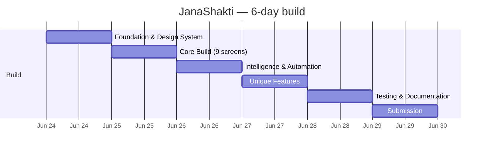

# JanaShakti — Development Timeline

> **जनशक्ति — People's Power**
> A day-by-day build log for Vibe2Ship 2026 (PS2 — Community Hero). Solo developer, six days, June 24–29, 2026.

This log reconstructs how JanaShakti was built — foundation first, then core screens, then intelligence + automation, then the differentiating features, then testing + documentation, then submission. Effort per day is estimated from the real complexity of the shipped code (`src/`, `tests/`, `firestore.rules`).

---

## Day 1 — Foundation & Design System (June 24)

Laying the rails so every later screen is consistent and free-tier-safe.

- **Project setup** — React 18 + Vite 5 + `@vitejs/plugin-react`; `vite-plugin-pwa` (Workbox) wired for an installable, offline app.
- **CLAUDE.md specification** — the project's law: a strict colour system (cyan `#00d4ff` primary, green `#16a34a` secondary, all derived from the logo), typography rules (string font-weights only), LinkedIn-style component patterns (0.5px-border cards), Lucide-only icons, navigation rules, and "strictly forbidden" guard-rails (no TypeScript, no emoji UI icons, no Firebase Storage).
- **Logo & brand identity** — holographic-fist logo, icon set (192/512), PWA `manifest.json` (theme `#00d4ff`, background `#04091a`).
- **Firebase configuration** — `firebase.js`: Auth + Cloud Firestore with `persistentLocalCache` (IndexedDB, multi-tab) and graceful fallback; Hosting + COOP header for auth popups.
- **Firestore data models + security rules** — `firestore.rules` with field-level authorization (owner / authority allowlist / community fields), `firestore.indexes.json` composite indexes.
- **Project structure** — `screens/`, `components/`, `hooks/`, `agents/`, `utils/`, `constants/`, `theme/`.
- **Theme system foundations** — `theme/colors.js`, `typography.js`, `spacing.js`, `components.js` (reusable style objects + `severityStyle()` / `statusColor()`).
- **Environment variables** — `.env.example` template (Firebase, Gemini, Maps, Cloudinary, n8n, AI-provider switch); zero hardcoded keys.

---

## Day 2 — Core Build (June 25)

The app you can navigate, end to end.

- **9 core screens** (lazy-loaded in `App.jsx` under `Suspense` + `ErrorBoundary`):
  `HomeScreen` (auth lives here), `ReportScreen`, `MapScreen`, `ProfileScreen`, `IssueDetail`, `AnalyticsDashboard`, `AuthorityDashboard`, `AgentsShowcase`, `Onboarding`. *(Three more — Leaderboard, JournalistDashboard, NotificationsScreen — land on Day 4.)*
- **Reusable components (24)** — `BottomNav`, `TopNav`, `IssueCard` (memo), `SeverityBadge` (memo), `PressureMeter` (memo), `StatsCard` (memo), `EmptyState`, `LoadingScreen`, `LoadingSkeleton`, `ShowMore`, `Toast` + `ToastProvider`, `Avatar`, `IndiaFlag`, `NationTagline`, `ErrorBoundary`, `InstallBanner`, `NotificationBell`, `LocationPicker`, `LocationProvider`, `AffiliationPicker`, `AgentPipelineOverlay`, `BeforeAfterSlider`, `ChartCarousel` (plus `ResolutionCelebration`, `VoiceAssistant` added later).
- **4 AI Agents with Gemini** — `issueAnalyzer` (Agent 1, Vision + function-calling), `duplicateDetector` (Agent 2), `authorityRouter` (Agent 3), `resolutionPredictor` (Agent 4) — wired through `orchestrator.js`.
- **Custom hooks (7)** — `useAuth`, `useUser`, `useIssues`, `useAgents`, `useLocation` (`useGeoLocation`), `useNotifications`, `usePagination`.
- **Utility modules** — `gemini.js` (the central `fetchAI` dispatch + model fallback chain + `logAgent`), `n8n.js` (webhook trigger), `social.js` (share links). *(Plus `aiProxy.js` for the optional server-side proxy.)*
- **PWA configuration** — manifest, Workbox service worker (NetworkFirst for Firestore), `InstallBanner`.
- **Theme system** — colours, typography, spacing, component styles finalised.
- **Constants** — `issueTypes.js` (issue taxonomy, severity, status pipeline, civic-score points, levels, badges, escalation levels), `departments.js` (department map + SLAs), `cities.js`, `mapStyle.js`.

---

## Day 3 — Intelligence & Automation (June 26)

Turning a reporting form into an accountability engine.

- **n8n Cloud + 4 workflows** — `issue_intelligence` (every report), `authority_email` (Agent 3 routing → formal department email via HTTP node), `social_post` (Critical / ≥ 5 confirmations), `escalation` (level increase) — all fire-and-forget and try/catch-wrapped so a webhook outage never affects the app. (Optional AI proxy workflow `n8n/janashakti-ai-proxy.json` keeps the model key server-side.)
- **Complaint ID system** — `JS-{CITY}-{YEAR}-{SEQUENCE}` (`utils/complaintId.js`).
- **Auto-escalation engine** — `utils/escalation.js`: 7 / 14 / 30-day triggers, Wall-of-Shame flag at 30 days, escalation webhook.
- **Resolution Celebration** — `ResolutionCelebration.jsx` confetti + a one-time **+25** reporter reward (idempotent via `resolutionCelebrated`).
- **Social sharing** — X, WhatsApp, LinkedIn (+ Facebook, Telegram) intent links and the consent model (`tag` / `anonymous` / `none`).
- **Streak tracking** — daily +2 bonus in `useAuth`.
- **AI City Insights** — `generateCityInsights()` (Gemini) on the Analytics dashboard.
- **n8n webhook integration in the report flow** — `issue_intelligence` + conditional `social_post`.
- **Sample data seeder** — ~15 issues across 3 cities (later superseded by the Admin-SDK importer `scripts/importExcel.mjs`).
- **First deployment** — Firebase Hosting (`firebase.json`, SPA rewrites).

---

## Day 4 — Unique Features (June 27)

The differentiators — what makes JanaShakti more than a complaint box.

- **Traffic Signal issue type** — added to the taxonomy + department map.
- **Wall of Fame + Leaderboard** — `screens/Leaderboard.jsx` with **4 tabs**: Citizens (live), Companies, Colleges, Representatives; Crown/Medal/Award top-3, "YOU" highlight.
- **Corporate Civic Adoption** — `AffiliationPicker`, `adoptedBy` auto-tagging, map zone overlays, `utils/orgStats.js` (live counts), `utils/csrReport.js` (Gemini CSR report + LinkedIn post), Civic Champion badge.
- **College Civic Adoption** — campus programs + inter-college competition (org `type: college`), Civic Campus badge.
- **Journalist Dashboard** — `screens/JournalistDashboard.jsx`, `utils/story.js` (≥ 3-of-6 story signals), `utils/pressRelease.js` (Gemini press release), 48h exclusive claim enforced in rules.
- **Elected Representative Scorecard** — `constants/representatives.js` + `utils/representatives.js`: GPS → ward → representative tagging, `calculateScorecard()` resolution-rate ranking (neutral by design).
- **Privacy-safe Excel Export** — `utils/exportToExcel.js`: allowlist sanitization, name masking, aggregate Summary sheet — on 4 dashboards.
- **Gemini Voice Assistant** — `components/VoiceAssistant.jsx` + `utils/civicDataContext.js`: Web Speech STT/TTS, live PII-free civic context, English/Hindi, `callGeminiPlainText`.
- **5th agent + extra screens** — `resolutionVerifier.js` (Agent 5), `NotificationsScreen`, `useNotifications`; Agent 5 wired into the Authority resolve flow.
- **ESG & SDG Impact Intelligence** — `agents/esgScorer.js` (Agent 6 — ESG Impact Scorer): `scoreESGImpact()` + `generateCorporateESGReport()`. Once an issue is **Resolved**, Gemini scores it across Environmental / Social / Governance (overall = weighted **0.35 / 0.35 / 0.30**) and maps it to UN SDGs. Backed by `constants/esg.js` (`ISSUE_SDG_MAP`, `SDG_COLORS`, `ESG_WEIGHTS`, `IMPACT_ESTIMATES`, `ESG_GRADES`, `ESG_BADGES`) and components `ESGScoreCard` / `SDGBadge` / `CityESGCard`. Surfaced across `IssueDetail` (ESG score card + share), `AnalyticsDashboard` (new ESG tab), `ProfileScreen` (ESG impact + 5 badges), `AgentsShowcase` (Agent 6), `HomeScreen` (city ESG chip), and `AuthorityDashboard` (scores on resolve). `firestore.rules` updated so `esgScore` / `esgScoredAt` are authority fields; new-user docs seed ESG counters.
- **Mock X page** for the demo.

---

## Day 5 — Testing & Documentation (June 28) — *today*

Proving it works, and writing it down.

- **AI Testing Pipeline (3 Gemini agents)** — `tests/agents/`:
  - `testWriter.js` — generates Vitest tests from source into the isolated `tests/ai/**` tree.
  - `testAnalyzer.js` — runs the suite, Gemini diagnoses failures + health.
  - `reportGenerator.js` — runs suite + coverage, Gemini health/risk assessment, branded HTML/JSON report.
- **Test generation, execution, analysis, HTML report** — deterministic suite (`src/**` + `tests/unit`) kept green; AI tests isolated; coverage via `@vitest/coverage-v8`; latest report in `tests/reports/`.
- **Documentation** — `docs/ARCHITECTURE.md` (system + flow diagrams + schema + security), `docs/FEATURES.md`, `docs/TIMELINE.md`, `docs/SUBMISSION.md`.
- **Demo video recording.**
- **Final deployment** with clean data (Admin-SDK import via `scripts/importExcel.mjs` + `scripts/importRepresentatives.mjs`).

---

## Day 6 — Submission (June 29)

- **Recurrence detection — Agent 2 expansion** — added `checkRecurrence`: a *resolved* issue recurring at the same spot within **365 days** is flagged as a recurrence. The new report links the prior complaint (`recurrenceOf` + complaint ID + resolved date), the authority email gains a **"RECURRENCE NOTICE"** that the earlier fix didn't hold, and IssueDetail shows a "Recurring issue" banner. Deterministic, fail-open, cross-account (read-only on prior issues). Agent 2 is now the **Duplicate & Recurrence Detector**.
- **Points-system cleanup** — every civic-point award now reads from the `CIVIC_SCORE_POINTS` constants (no magic numbers); single source of truth across report / verify / resolve / authority actions.
- **Final smoke testing** on the deployed URL.
- **Demo polish** — confirm the Gemini 2.5 Flash chain is healthy for the demo run.
- **Final build & deploy** — `npm run deploy` (Hosting + Firestore rules + indexes).
- **Submit on BlockseBlock** before **2:00 PM IST**.

---

## Tech Stack Summary

| Layer | Technology | Version |
|---|---|---|
| Framework | React | ^18.3.1 |
| Renderer | React DOM | ^18.3.1 |
| Build / dev | Vite | ^5.4.0 |
| React plugin | @vitejs/plugin-react | ^4.3.0 |
| PWA | vite-plugin-pwa (Workbox) | ^0.20.0 |
| Routing | react-router-dom | ^6.23.0 |
| Charts | recharts | ^2.12.0 |
| Icons | lucide-react | ^0.383.0 |
| Backend SDK | firebase (Auth + Firestore + Hosting) | ^10.12.0 |
| AI | Google Gemini 2.5 Flash (AI Studio) | API |
| Maps | Google Maps JS API + Geocoding API | API |
| Automation | n8n Cloud | 14-day trial |
| Video hosting | Cloudinary (unsigned) | API |
| Data import (dev) | firebase-admin | ^12.7.0 |
| Excel (dev) | xlsx | ^0.18.5 |
| Image tooling (dev) | sharp | ^0.35.2 |
| Testing | Vitest + @testing-library/react + jsdom | ^2.1.0 / ^16.3.2 / ^29.1.1 |
| Language | **JSX only** — zero TypeScript | — |

---

## Team

**Solo developer.** Every screen, agent, hook, utility, rule, test, and document above was designed and built by one person across six days.

---

*JanaShakti — जनशक्ति — People's Power*
*Vibe2Ship 2026 — PS2: Community Hero*
